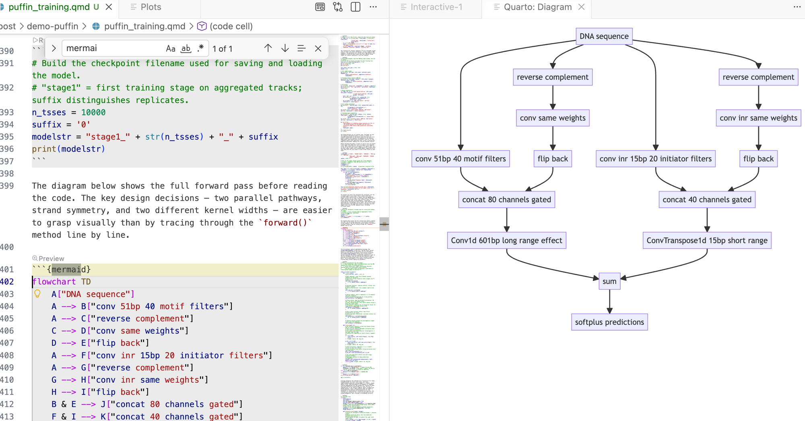

Original material from Roxana copied here https://drive.google.com/drive/folders/1V5sgU9m2KkW9xJ3fgLoOaYS1WnqEcooo

```{python}
DATADIR = "/Users/haekyungim/Library/CloudStorage/Box-Box/LargeFiles/imlab-data/data-Github/web-data/2026-04-21-puffin-training"
install_packages = False   # Set True to pip-install dependencies
build_dataset = False      # Set True to download from Zenodo and build dataset_10k.npz via selene_sdk
train = False              # Set True to run training (slow); otherwise loads saved checkpoint
```

```{python}
if install_packages:
    import subprocess
    subprocess.run(["pip", "install", "pyBigWig", "pytabix", "torch-fftconv",
                    "logomaker", "pandas", "numpy", "seaborn", "matplotlib"], check=True)
    subprocess.run(["pip", "install", "torch", "torchvision", "torchaudio",
                    "--index-url", "https://download.pytorch.org/whl/cu121"], check=True)
```

```{python}
import os
import sys
import time
import pandas as pd
import numpy as np
import pyBigWig          # reads bigwig files: genome-wide signal tracks stored as (chrom, start, end, value) intervals
import tabix             # reads tabix-indexed BED files, used here to query blacklist regions
import torch
from torch import nn
from torch_fftconv import FFTConv1d  # FFT-based convolution — efficient for large kernels (601 bp)
import seaborn as sns
from matplotlib import pyplot as plt
import logomaker          # draws sequence logos to visualize DNA motif PWMs
```

```{python chdir DATADIR}
os.chdir(DATADIR)
```

```{python build dataset}
### Optional: data processing step. Can skip this cell and load processed data directly.
### Original data: https://zenodo.org/records/7954971
### Requires Selene: git clone https://github.com/kathyxchen/selene.git
###   cd selene && git checkout custom_target_support
###   python setup.py build_ext --inplace && python setup.py install

if build_dataset:
    from selene_sdk.targets import Target
    import selene_sdk

    n_tsses = 10000  # use the top 10,000 TSSes ranked by CAGE expression
    suffix = '0'
    modelstr = "stage1_" + str(n_tsses) + "_" + suffix
    print(modelstr)

    # Load TSS (Transcription Start Site) annotations from FANTOM5 CAGE data.
    # Each row is one TSS with its chromosome, position, and strand.
    # Sorted by CAGE signal so the top rows are the most-expressed genes.
    tsses = pd.read_table(
        os.path.join(DATADIR, "resources/FANTOM_CAT.lv3_robust.tss.sortedby_fantomcage.hg38.v5.highconf.tsv"),
        sep="\t",
    )
    # Load the hg38 reference genome so we can extract DNA sequences around each TSS.
    genome = selene_sdk.sequences.Genome(
        input_path=os.path.join(DATADIR, "resources/Homo_sapiens.GRCh38.dna.primary_assembly.fa"),
    )

    class GenomicSignalFeatures(Target):
        """
        Reads multiple bigwig signal tracks over a genomic window and returns
        a 2-D array (n_tracks × window_length). Blacklisted regions — genomic
        intervals with known sequencing artifacts — are zeroed out or replaced
        with a scaled proxy track so they don't corrupt training targets.
        """
        def __init__(
            self,
            input_paths,
            features,
            shape,
            blacklists=None,
            blacklists_indices=None,
            replacement_indices=None,
            replacement_scaling_factors=None,
        ):
            self.input_paths = input_paths
            self.initialized = False  # bigwig handles are opened lazily on first query
            self.blacklists = blacklists
            self.blacklists_indices = blacklists_indices
            self.replacement_indices = replacement_indices
            self.replacement_scaling_factors = replacement_scaling_factors

            self.n_features = len(features)
            self.feature_index_dict = dict(
                [(feat, index) for index, feat in enumerate(features)]
            )
            self.shape = (len(input_paths), *shape)

        def get_feature_data(
            self, chrom, start, end, nan_as_zero=True, feature_indices=None
        ):
            # Open bigwig file handles on the first call (avoids opening thousands of files upfront).
            if not self.initialized:
                self.data = [pyBigWig.open(path) for path in self.input_paths]
                if self.blacklists is not None:
                    self.blacklists = [
                        tabix.open(blacklist) for blacklist in self.blacklists
                    ]
                self.initialized = True
            if feature_indices is None:
                feature_indices = np.arange(len(self.data))
            # wigmat shape: (n_tracks, window_length)
            wigmat = np.zeros((len(feature_indices), end - start), dtype=np.float32)
            for i in feature_indices:
                try:
                    wigmat[i, :] = self.data[i].values(chrom, start, end, numpy=True)
                except:
                    print(chrom, start, end, self.input_paths[i], flush=True)
                    raise

            # Zero out (or replace) any positions that fall inside blacklisted regions.
            # Blacklists mark genomic regions with known sequencing artifacts
            # (e.g., satellite repeats, centromeres) that produce spurious signal.
            if self.blacklists is not None:
                if self.replacement_indices is None:
                    if self.blacklists_indices is not None:
                        # Zero only the specific tracks associated with each blacklist.
                        for blacklist, blacklist_indices in zip(
                            self.blacklists, self.blacklists_indices
                        ):
                            for _, s, e in blacklist.query(chrom, start, end):
                                wigmat[
                                    blacklist_indices,
                                    np.fmax(int(s) - start, 0) : int(e) - start,
                                ] = 0
                    else:
                        # Zero all tracks uniformly.
                        for blacklist in self.blacklists:
                            for _, s, e in blacklist.query(chrom, start, end):
                                wigmat[:, np.fmax(int(s) - start, 0) : int(e) - start] = 0
                else:
                    # Replace blacklisted CAGE signal with a scaled proxy track
                    # (e.g., ENCODE CAGE) rather than zeroing, to preserve approximate signal shape.
                    for (
                        blacklist,
                        blacklist_indices,
                        replacement_indices,
                        replacement_scaling_factor,
                    ) in zip(
                        self.blacklists,
                        self.blacklists_indices,
                        self.replacement_indices,
                        self.replacement_scaling_factors,
                    ):
                        for _, s, e in blacklist.query(chrom, start, end):
                            wigmat[
                                blacklist_indices,
                                np.fmax(int(s) - start, 0) : int(e) - start,
                            ] = (
                                wigmat[
                                    replacement_indices,
                                    np.fmax(int(s) - start, 0) : int(e) - start,
                                ]
                                * replacement_scaling_factor
                            )
            if nan_as_zero:
                wigmat[np.isnan(wigmat)] = 0
            return wigmat

    # The 10 output tracks are aggregated (multi-experiment) signal profiles
    # on the plus and minus strand from four TSS-focused assays:
    #   CAGE        - Cap Analysis of Gene Expression (5' capped RNA)
    #   ENCODE CAGE - CAGE from the ENCODE consortium
    #   RAMPAGE     - RNA Annotation and Mapping of Promoters for Analysis of Gene Expression
    #   GRO-cap     - Global Run-On sequencing capturing nascent RNA 5' ends
    #   PRO-cap     - Precision Run-On sequencing capturing paused Pol II
    rdir = os.path.join(DATADIR, "resources")
    tfeature = GenomicSignalFeatures(
        [
            f"{rdir}/agg.plus.bw.bedgraph.bw",           # CAGE +
            f"{rdir}/agg.encodecage.plus.v2.bedgraph.bw", # ENCODE CAGE +
            f"{rdir}/agg.encoderampage.plus.v2.bedgraph.bw", # RAMPAGE +
            f"{rdir}/agg.plus.grocap.bedgraph.sorted.merged.bw",  # GRO-cap +
            f"{rdir}/agg.plus.allprocap.bedgraph.sorted.merged.bw",  # PRO-cap +
            f"{rdir}/agg.minus.allprocap.bedgraph.sorted.merged.bw", # PRO-cap −
            f"{rdir}/agg.minus.grocap.bedgraph.sorted.merged.bw",    # GRO-cap −
            f"{rdir}/agg.encoderampage.minus.v2.bedgraph.bw",        # RAMPAGE −
            f"{rdir}/agg.encodecage.minus.v2.bedgraph.bw",           # ENCODE CAGE −
            f"{rdir}/agg.minus.bw.bedgraph.bw",                      # CAGE −
        ],
        [
            "cage_plus", "encodecage_plus", "encoderampage_plus",
            "grocap_plus", "procap_plus",
            "procap_minus", "grocap_minus", "encoderampage_minus",
            "encodecage_minus", "cage_minus",
        ],
        (4000,),
        # Blacklist files flag FANTOM CAGE artifact regions on each strand.
        [
            f"{rdir}/fantom.blacklist8.plus.bed.gz",
            f"{rdir}/fantom.blacklist8.minus.bed.gz",
        ],
        [0, 9],           # blacklist affects CAGE tracks (indices 0 and 9)
        [1, 8],           # replace with ENCODE CAGE (indices 1 and 8) scaled by factor below
        [0.61357, 0.61357],
    )

    # Extract one-hot DNA sequence and signal targets for each TSS.
    # We take a 4650-bp window centered on each TSS (wider than the 4000-bp target
    # window to give the convolutions room at the edges).
    window_size = 4650
    seqs = []
    tars = []
    for randi in range(n_tsses):
        chrm, pos, strand = (
            tsses["chr"].values[randi],
            tsses["TSS"].values[randi],
            tsses["strand"].values[randi],
        )
        # Minus-strand TSSes are shifted by 1 bp so the TSS falls at the center
        # after reverse-complementing the sequence.
        offset = 1 if strand == "-" else 0
        # get_encoding_from_coords returns a (window, 4) one-hot array [A, C, G, T]
        # and automatically reverse-complements if strand == "-".
        seq = genome.get_encoding_from_coords(
            tsses["chr"][randi],
            tsses["TSS"][randi] - window_size // 2 + offset,
            tsses["TSS"][randi] + window_size // 2 + offset,
            tsses["strand"][randi],
        )
        tar = tfeature.get_feature_data(
            tsses["chr"][randi],
            tsses["TSS"][randi] - window_size // 2 + offset,
            tsses["TSS"][randi] + window_size // 2 + offset,
        )
        # For minus-strand genes, flip both axes so the signal reads 5'→3'
        # relative to the gene, matching the reverse-complemented sequence.
        if strand == "-":
            tar = tar[::-1, ::-1]
        seqs.append(seq)
        tars.append(tar)

    # Stack into arrays and fix axis order:
    # seqs: (n_tsses, 4, 4650)  — batch × nucleotides × positions
    # tars: (n_tsses, 10, 4650) — batch × tracks × positions
    seqs = np.dstack(seqs)
    tars = np.dstack(tars)
    seqs = seqs.transpose([2, 1, 0])
    tars = tars.transpose([2, 0, 1])

    # Shuffle so train/valid splits aren't biased by TSS expression rank.
    np.random.seed(1)
    randinds = np.random.permutation(np.arange(n_tsses))
    seqs = seqs[randinds, :]
    tars = tars[randinds, :]
    tsses_rand = tsses.iloc[randinds, :]

    # Hold out chr8 and chr9 as test set, chr10 as validation set.
    # Splitting by chromosome prevents data leakage from nearby genomic loci.
    train_seqs = seqs[~tsses_rand["chr"].isin(["chr8", "chr9", "chr10"]).values, :]
    valid_seqs = seqs[tsses_rand["chr"].isin(["chr10"]).values, :]
    train_tars = tars[~tsses_rand["chr"].isin(["chr8", "chr9", "chr10"]).values, :]
    valid_tars = tars[tsses_rand["chr"].isin(["chr10"]).values, :]
    np.savez(os.path.join(DATADIR, "dataset_10k.npz"),
             train_seqs=train_seqs, train_tars=train_tars,
             valid_seqs=valid_seqs, valid_tars=valid_tars)
```

The `build_dataset` cell above handles everything up to this point: downloading the hg38 reference genome and FANTOM5 CAGE signal tracks, extracting 4,650-bp windows centered on the top 10,000 TSSes, one-hot-encoding the DNA sequence, and splitting examples by chromosome (chr8/9 = test, chr10 = validation, the rest = training). The result is saved as a single `.npz` archive so this slow, resource-intensive step only runs once. From here on we just load those pre-processed arrays and work with them directly.

```{python load data}
# Load preprocessed arrays saved by the build_dataset step above.
# train_seqs: (N_train, 4, 4650)  — one-hot DNA sequences [A,C,G,T] × bp
# train_tars: (N_train, 10, 4650) — 10 TSS signal tracks × bp
# Valid arrays have the same shape with N_valid examples (chr10 TSSes).
data = np.load(os.path.join(DATADIR, 'dataset_10k-001.npz'))
train_seqs = data['train_seqs']
train_tars = data['train_tars']
valid_seqs = data['valid_seqs']
valid_tars = data['valid_tars']
```

Before plotting anything, it is worth confirming that the arrays have the dimensions we expect. Sequences are stored as `(N, 4, L)` — N examples, 4 nucleotides (one-hot), L base pairs — and targets as `(N, 10, L)` — same N examples, 10 assay tracks, same L positions. Checking shapes is a quick sanity check that the data loaded correctly and that train/validation splits look reasonable.

```{python}
# Summary of all four arrays: shape and what each axis means.
for name, arr in [("train_seqs", train_seqs), ("train_tars", train_tars),
                  ("valid_seqs", valid_seqs), ("valid_tars", valid_tars)]:
    n, c, l = arr.shape
    axis1 = "4 nucleotides [A,C,G,T]" if "seqs" in name else "10 signal tracks"
    print(f"{name:12s}  shape={arr.shape}   axis0={n} sequences, axis1={c} ({axis1}), axis2={l} bp")
```

The training set contains sequences from all autosomes except chr8, 9 (test) and chr10 (validation), giving roughly 8,000 examples. The validation set (chr10) has a few hundred. Each example is 4,650 bp long — wider than the 4,000-bp target region for reasons explained in the next diagram.

```{python}
# TSS window diagram: show the 4650-bp input window, the TSS at center,
# and the 325-bp margins excluded from the training loss.
fig, ax = plt.subplots(figsize=(12, 2.2))
ax.set_xlim(-2500, 2500)
ax.set_ylim(0, 1)
ax.axis("off")

full_start, full_end = -2325, 2325
margin = 325

# Full input window
ax.barh(0.55, full_end - full_start, left=full_start, height=0.25,
        color="lightsteelblue", edgecolor="steelblue", linewidth=1)

# Training region (central 4000 bp)
ax.barh(0.55, (full_end - margin) - (full_start + margin), left=full_start + margin,
        height=0.25, color="steelblue", edgecolor="navy", linewidth=1)

# TSS marker
ax.axvline(0, color="red", linewidth=1.5, ymin=0.3, ymax=0.9)
ax.text(0, 0.92, "TSS", ha="center", va="bottom", fontsize=9, color="red")

# Margin annotations
for side, x0, x1 in [("left margin\n325 bp", full_start, full_start + margin),
                      ("right margin\n325 bp", full_end - margin, full_end)]:
    mid = (x0 + x1) / 2
    ax.annotate("", xy=(x1, 0.3), xytext=(x0, 0.3),
                arrowprops=dict(arrowstyle="<->", color="gray", lw=1))
    ax.text(mid, 0.18, side, ha="center", va="top", fontsize=7.5, color="gray")

# Full window annotation
ax.annotate("", xy=(full_end, 0.88), xytext=(full_start, 0.88),
            arrowprops=dict(arrowstyle="<->", color="steelblue", lw=1))
ax.text(0, 0.99, "input window: 4650 bp", ha="center", va="top", fontsize=8.5, color="steelblue")

# Training region annotation
ax.annotate("", xy=(full_end - margin, 0.42), xytext=(full_start + margin, 0.42),
            arrowprops=dict(arrowstyle="<->", color="navy", lw=1))
ax.text(0, 0.41, "training region: 4000 bp", ha="center", va="top", fontsize=8.5, color="navy")

ax.set_title(
    "Each example is a 4650-bp window centered on a TSS.\n"
    "The 325-bp margins are excluded from the loss — convolution edge effects make predictions unreliable there.",
    fontsize=9, pad=4
)
plt.tight_layout()
plt.show()
```

The 325-bp margins act as a buffer zone. The model can use the sequence information there to build up context for accurate predictions in the centre, but we do not ask it to predict signal there because zero-padding at the sequence edges makes those predictions unreliable. Think of it like cropping a photo after applying a blur filter — the blurred edges are discarded, keeping only the well-defined interior.

Before building the model it helps to look at the raw targets — the signal the model must learn to predict from sequence alone. Each column below is one gene's TSS region; each row is one of the 10 assay tracks. Comparing across columns shows how much signal shape varies between genes; comparing across rows shows how the five assays on each strand relate to each other.

```{python}
track_names = ["CAGE+", "ENCODE CAGE+", "RAMPAGE+", "GRO-cap+", "PRO-cap+",
               "PRO-cap−", "GRO-cap−", "RAMPAGE−", "ENCODE CAGE−", "CAGE−"]
center = 4650 // 2

# Plot all 10 signal target tracks for a few sequences.
# Columns = sequences (same DNA position axis); rows = epigenetic tracks.
n_examples = 3
n_tracks = 10
x = np.arange(4650) - center   # positions relative to TSS

fig, axes = plt.subplots(n_tracks, n_examples, figsize=(5 * n_examples, 2 * n_tracks), sharey="row", sharex=True)
for t in range(n_tracks):
    for idx in range(n_examples):
        ax = axes[t, idx]
        ax.plot(x, train_tars[idx, t, :], linewidth=0.6, color="steelblue" if t < 5 else "tomato")
        ax.axvline(0, color="gray", linewidth=0.5, linestyle="--")
        if t == 0:
            ax.set_title(f"Sequence {idx}", fontsize=9)
        if idx == 0:
            ax.set_ylabel(track_names[t], fontsize=8)
        ax.set_xlim(-2000, 2000)
        sns.despine(ax=ax)

fig.supxlabel("Position relative to TSS (bp)", fontsize=9)
plt.suptitle("Training targets: 10 TSS signal tracks for 3 sequences", fontsize=10, y=1.01)
plt.tight_layout()
plt.show()
```

The dashed line marks the annotated TSS coordinate, but the strongest peak is not always there — genes often have multiple TSSes spread across a region, and the aggregated signal reflects all of them. Plus-strand tracks (blue, top 5 rows) and minus-strand tracks (red, bottom 5 rows) often mirror each other near active promoters, reflecting transcription initiating on both strands. Peak sharpness and amplitude vary considerably across genes, and not all assays agree perfectly. The model must learn to reproduce the full signal track from the DNA sequence alone, including off-center peaks.

```{python}
# Build the checkpoint filename used for saving and loading the model.
# "stage1" = first training stage on aggregated tracks; suffix distinguishes replicates.
n_tsses = 10000
suffix = '0'
modelstr = "stage1_" + str(n_tsses) + "_" + suffix
print(modelstr)
```

The diagram below shows the full forward pass before reading the code. The key design decisions — two parallel pathways, strand symmetry, and two different kernel widths — are easier to grasp visually than by tracing through the `forward()` method line by line.

```{mermaid}
flowchart TD
    A["DNA sequence"]

    subgraph LP["Long-range pathway (motif)"]
        direction TB
        B["conv 51bp\n40 motif filters"]
        C["reverse complement"]
        D["conv same weights"]
        E["flip back"]
        C --> D --> E
    end

    subgraph SP["Short-range pathway (initiator)"]
        direction TB
        F["conv inr 15bp\n20 initiator filters"]
        G["reverse complement"]
        H["conv inr same weights"]
        I["flip back"]
        G --> H --> I
    end

    A --> B
    A --> C
    A --> F
    A --> G

    B --> J["concat 80 channels gated"]
    E --> J
    F --> K["concat 40 channels gated"]
    I --> K

    J --> L["Conv1d 601bp\nlong range effect"]
    K --> M["ConvTranspose1d 15bp\nshort range"]

    L --> N["sum"]
    M --> N
    N --> O["softplus predictions"]
```



The two pathways capture complementary biology: the **long-range pathway** (51-bp conv → 601-bp effect kernel) detects TF binding motifs and learns how far upstream or downstream each motif influences transcription initiation. The **short-range pathway** (15-bp conv → 15-bp effect kernel) captures the precise nucleotide composition right at the TSS — elements like the TATA box and Initiator that position the transcription start site to within a few base pairs. The strand-symmetry trick doubles the effective training data without adding any parameters.

```{python}
# Puffin's architecture has two stages:
#   1. Motif detection: short 1-D convolutions scan the DNA sequence for known TF binding patterns.
#   2. Effect prediction: longer convolutions map each detected motif to a positional effect profile
#      (how much does a motif at position X contribute to transcription signal at position Y?).

class SimpleNet(nn.Module):
    def __init__(self):
        super(SimpleNet, self).__init__()

        # Motif detector: scans the 4-channel one-hot sequence for 40 motifs,
        # each with a 51-bp receptive field (roughly one TF binding site).
        self.conv = nn.Conv1d(
            4, 40, kernel_size=51, padding=25
        )

        # Initiator detector: captures shorter (~15 bp) core promoter elements
        # such as the Initiator (Inr) element right at the TSS.
        self.conv_inr = nn.Conv1d(
            4, 20, kernel_size=15, padding=7
        )

        # Gating sigmoid: used as sigmoid(y) * y to suppress near-zero responses
        # while preserving magnitude for strong matches.
        self.activation = nn.Sigmoid()

        # Effect kernel: maps the 80 motif activations (40 fwd + 40 rev) to 10 output tracks
        # using a 601-bp kernel. This learns *where* around a motif the signal peaks.
        # FFTConv1d is a drop-in for nn.Conv1d but faster for large kernels; overridden below on MPS.
        self.deconv = FFTConv1d(
            80, 10, kernel_size=601, padding=300
        )

        # Short-range initiator effect: maps 40 Inr activations to 10 tracks
        # with a narrower 15-bp kernel (initiator effects are very local).
        self.deconv_inr = nn.ConvTranspose1d(
            40, 10, kernel_size=15, padding=7
        )

        # Softplus ensures outputs are non-negative (signal counts can't be negative).
        self.softplus = nn.Softplus()

    def forward(self, x):
        # Run the motif detector on both the forward strand and its reverse complement,
        # then flip the reverse-complement activations back to the forward orientation.
        # This makes every motif detector strand-agnostic — the model sees the same
        # binding site regardless of which strand it appears on.
        y = torch.cat(
            [self.conv(x), self.conv(x.flip([1, 2])).flip([2])], 1
        )  # shape: (batch, 80, seq_len)

        y_inr = torch.cat(
            [self.conv_inr(x), self.conv_inr(x.flip([1, 2])).flip([2])], 1
        )  # shape: (batch, 40, seq_len)

        # Gated activation: sigmoid(y) * y is a smooth version of ReLU that retains
        # sign information and scales strong activations more than weak ones.
        yact = self.activation(y) * y
        y_inr_act = self.activation(y_inr) * y_inr

        # Sum long-range motif effects and short-range initiator effects,
        # then apply Softplus to keep predictions non-negative.
        y_pred = self.softplus(self.deconv(yact) + self.deconv_inr(y_inr_act))
        return y_pred  # shape: (batch, 10, seq_len)
```

```{python}
if torch.backends.mps.is_available():
    device = torch.device("mps")   # Apple Silicon GPU
    FFTConv1d = nn.Conv1d  # MPS doesn't support the bmm op used by torch_fftconv; nn.Conv1d is identical
elif torch.cuda.is_available():
    device = torch.device("cuda")  # NVIDIA GPU
else:
    device = torch.device("cpu")
print(f"Using device: {device}")

net = SimpleNet()
```

Training optimizes the combined loss — profile KL for shape, PseudoPoissonKL for total count level, and three regularization penalties — using AdamW (lr = 5×10⁻⁴, weight decay = 0.01). Each mini-batch of 16 examples is randomly reverse-complemented with 50% probability, giving the model twice the effective training data for free. The loss is computed only on the central 4,000-bp region (trimming the 325-bp margins). Every 1,000 gradient steps the model is evaluated on the held-out chr10 validation set; the checkpoint is saved whenever validation loss improves. The training and validation loss curves plotted below are the primary diagnostic that training is proceeding correctly.

```{python}
#| scrolled: true
if train:
    net.to(device)
    net.train()
    net.conv.weight.requires_grad = True
    net.conv.bias.requires_grad = True
    params = [p for p in net.parameters() if p.requires_grad]
    # AdamW = Adam with decoupled weight decay, which works better than L2 regularization
    # added to the loss for adaptive-gradient optimizers.
    optimizer = torch.optim.AdamW(params, lr=0.0005, weight_decay=0.01)

    def PseudoPoissonKL(lpred, ltarget):
        # Poisson KL divergence: KL(Poisson(target) || Poisson(pred)).
        # Unlike profile KL below, this term penalizes absolute count errors,
        # encouraging the model to predict the right total signal level.
        return ltarget * torch.log((ltarget + 1e-10) / (lpred + 1e-10)) + lpred - ltarget

    def KL(pred, target):
        # Normalize each track to a probability distribution (sum to 1 across positions),
        # then compute KL divergence. This measures how well the *shape* of the
        # predicted profile matches the target, ignoring overall magnitude.
        pred = (pred + 1e-10) / ((pred + 1e-10).sum(2)[:, :, None])
        target = (target + 1e-10) / ((target + 1e-10).sum(2)[:, :, None])
        return target * (torch.log(target + 1e-10) - torch.log(pred + 1e-10))

    def std2(x, axis, dim):
        # Generalized standard deviation using the dim-th moment.
        # Used to normalize the smoothness penalty so it is scale-invariant.
        return ((x - x.mean(axis=axis, keepdims=True)) ** dim).mean(axis=axis) ** (1 / dim)

    batchsize = 16
    stime = time.time()
    i = 0
    past_losses = []
    past_l2 = []
    past_l1act = []
    train_losses_stage1 = []
    valid_losses_stage1 = []
    # Equal weight for all 10 output tracks; could be tuned to emphasize certain assays.
    weights = torch.ones(10).to(device)
    bestloss = np.inf

    while True:
        # Shuffle batch order each epoch so the model doesn't memorize sequence.
        for j in np.random.permutation(range(train_seqs.shape[0] // batchsize)):
            sequence = train_seqs[j * batchsize : (j + 1) * batchsize, :, :]
            target = train_tars[j * batchsize : (j + 1) * batchsize, :, :]

            sequence = torch.FloatTensor(sequence)
            target = torch.FloatTensor(target)

            # Data augmentation: randomly reverse-complement each example.
            # The model must already handle both strands (by design), so this
            # effectively doubles the training set and improves generalization.
            if torch.rand(1) < 0.5:
                sequence = sequence.flip([1, 2])
                target = target.flip([1, 2])

            optimizer.zero_grad()
            pred = net(torch.Tensor(sequence.float()).to(device))

            # Profile loss: KL divergence on the central 4000-bp region.
            # The 325-bp margins on each side are trimmed because edge positions
            # have reduced context and less reliable predictions.
            loss0 = (
                KL(pred[:, :, 325:-325], target.to(device)[:, :, 325:-325])
                * weights[None, :, None]
            ).mean()

            # Smoothness penalty: penalizes large differences between adjacent
            # positions in the effect kernels (deconv weights). Divided by the
            # scale of the kernel so the penalty is relative, not absolute.
            # This encourages smooth, interpretable effect profiles.
            l2 = (
                (
                    (
                        (net.deconv.weight[:, :, :-1] - net.deconv.weight[:, :, 1:]) ** 2
                    ).mean(2)
                    / (std2(net.deconv.weight, axis=2, dim=4) ** 2 + 1e-10)
                )
                * (weights)[:, None]
            ).mean()

            # L1 on effect kernels: encourages most motifs to have near-zero effect,
            # so only a few motifs drive the prediction (sparse solution).
            l1act = (net.deconv.weight.abs() * (weights)[:, None, None]).mean()

            # L1 on motif detector weights: encourages simpler, more focused motifs.
            l1motif = net.conv.weight.abs().mean()

            # Combined loss: profile shape (KL) + count level (PseudoPoissonKL) + regularization.
            loss = (
                loss0
                + l2 * 2e-3
                + 1e-3
                * (
                    PseudoPoissonKL(
                        pred[:, :, 325:-325] / np.log(10), target.to(device)[:, :, 325:-325]
                    )
                    * weights[None, :, None]
                ).mean()
                + l1act * 5e-5
                + l1motif * 4e-5
            )

            loss.backward()

            past_losses.append(loss0.detach().cpu().numpy())
            past_l2.append(l2.detach().cpu().numpy())
            past_l1act.append(l1act.item())

            optimizer.step()

            if i % 100 == 0:
                print(f"Step {i} | train loss:" + str(np.mean(past_losses[-100:])), flush=True)
                train_losses_stage1.append(np.mean(past_losses[-100:]))
                past_losses = []

            # Every 1000 steps, evaluate on the held-out validation set (chr10).
            if i % 1000 == 0:
                with torch.no_grad():
                    past_losses = []
                    for j in range(valid_seqs.shape[0] // batchsize):
                        sequence = valid_seqs[j * batchsize : (j + 1) * batchsize, :, :]
                        target = valid_tars[j * batchsize : (j + 1) * batchsize, :, :]

                        sequence = torch.FloatTensor(sequence)
                        target = torch.FloatTensor(target)
                        if torch.rand(1) < 0.5:
                            sequence = sequence.flip([1, 2])
                            target = target.flip([1, 2])

                        optimizer.zero_grad()
                        pred = net(torch.Tensor(sequence.float()).to(device))

                        loss0 = (
                            KL(pred[:, :, 325:-325], target.to(device)[:, :, 325:-325])
                            * weights[None, :, None]
                        ).mean()

                        past_losses.append(loss0.detach().cpu().numpy())

                validloss = np.mean(past_losses)
                print(f"Step {i} | valid loss:" + str(validloss), flush=True)
                valid_losses_stage1.append(validloss)

                # Save the checkpoint whenever validation loss improves (early stopping criterion).
                if validloss < bestloss:
                    bestloss = validloss
                    torch.save(net.state_dict(), os.path.join(DATADIR, modelstr + ".pth"))
                if i // 1000 > 2000:
                    sys.exit()
            i = i + 1
```

```{python}
if train:
    torch.save(net.state_dict(), os.path.join(DATADIR, modelstr + ".pth"))
```

```{python}
net.load_state_dict(torch.load(os.path.join(DATADIR, modelstr + ".pth"), map_location=device))
net.to(device)
```

With the trained checkpoint loaded, we can run the model on held-out validation sequences (chr10 — never seen during training) and overlay predictions on the ground-truth signal. This is the most direct way to see whether the model has learned anything useful: does it predict peaks at the right positions and with roughly the right amplitude?

```{python}
# Predicted vs actual signal tracks for a few validation sequences.
# Columns = sequences; rows = epigenetic tracks (same layout as training targets above).
# Solid = ground truth, dashed = model prediction.
n_examples = 3
n_tracks = 10
x = np.arange(4650) - center

net.eval()
with torch.no_grad():
    seqs_batch = torch.FloatTensor(valid_seqs[:n_examples]).to(device)
    preds = net(seqs_batch).cpu().numpy()   # (n_examples, 10, 4650)

fig, axes = plt.subplots(n_tracks, n_examples, figsize=(5 * n_examples, 2 * n_tracks),
                         sharey="row", sharex=True)
for t in range(n_tracks):
    for idx in range(n_examples):
        ax = axes[t, idx]
        color = "steelblue" if t < 5 else "tomato"
        ax.plot(x, valid_tars[idx, t, :], linewidth=0.7, color=color, label="actual")
        ax.plot(x, preds[idx, t, :], linewidth=0.7, color=color, linestyle="--",
                alpha=0.8, label="predicted")
        ax.axvline(0, color="gray", linewidth=0.5, linestyle=":")
        ax.set_xlim(-2000, 2000)
        if t == 0:
            ax.set_title(f"Sequence {idx}", fontsize=9)
            ax.legend(fontsize=6, frameon=False)
        if idx == 0:
            ax.set_ylabel(track_names[t], fontsize=8)
        sns.despine(ax=ax)

fig.supxlabel("Position relative to TSS (bp)", fontsize=9)
plt.suptitle("Validation set: predicted (dashed) vs actual (solid) signal tracks", fontsize=10, y=1.01)
plt.tight_layout()
plt.show()
```

Look for cases where the dashed (predicted) and solid (actual) curves overlap closely near position 0 — that means the model correctly identifies both where transcription starts and how much signal to expect. When the peak position matches but the amplitude is off, the profile loss is low but the count loss is still high. When the curves diverge in shape, both losses are high. Notice also which assay tracks are consistently easier to predict than others — noisier or rarer assays tend to show larger residuals.

With training complete, we can look inside the model to see what it learned. The `conv` layer's 40 filters are the model's vocabulary of DNA binding motifs — each one is a 51-bp position weight matrix (PWM) that responds strongly to a specific sequence pattern. The paired effect (deconv) kernel for each motif is a 601-position profile describing *where* around the motif center the CAGE signal is predicted to change. Together, motif logo + effect curve is a complete, interpretable description of how one binding-site type contributes to transcription initiation. We rank motifs by a combined score (max absolute effect × motif sequence specificity) and display the top-ranked unique filters.

```{python}
#| scrolled: true
def plotfun(motifpwm, title=None, ax=None):
    """Draw a sequence logo from a PWM (position weight matrix).
    The PWM should have shape (positions, 4) with columns [A, C, G, T].
    Letter height encodes information content; shading below zero highlights
    positions that are below the average nucleotide frequency.
    """
    motifpwm = pd.DataFrame(motifpwm, columns=['A','C','G','T'])
    logo = logomaker.Logo(motifpwm,
                          shade_below=.5,
                          fade_below=.5,
                          ax=ax)

    logo.style_spines(visible=False)
    logo.style_spines(spines=['left', 'bottom'], visible=True)
    logo.style_xticks(rotation=90, fmt='%d', anchor=0)

    if title is not None:
        logo.ax.set_title(title, fontsize=10)

    logo.ax.set_xticks(range(motifpwm.shape[0]))
    logo.ax.set_xticklabels([str(i) for i in range(motifpwm.shape[0])], fontsize=6)
    logo.ax.tick_params(axis='x', which='major', labelsize=6, pad=-1)

    return logo

sns.set(rc={"figure.dpi":300, 'savefig.dpi':300})
sns.set_style("white")

# Extract the learned effect kernel for the first output track (CAGE plus-strand).
# net.deconv.weight has shape (10 output tracks, 80 motifs, 601 positions).
# weight[motif, :] is the 601-position profile showing how that motif affects
# signal as a function of distance from the motif center.
weight = net.deconv.weight[0,:,:].cpu().detach().numpy()  # shape: (80, 601)

# Score each of the 80 motif slots (40 fwd + 40 rev) by its maximum absolute effect.
w = net.deconv.weight[0,:,:].cpu().detach().abs().numpy().max(axis=1)  # shape: (80,)

# Scale by the motif detector's sequence specificity: a motif that fires strongly
# everywhere is less informative than one that fires only at a specific sequence.
mw = net.conv.weight.cpu().detach().numpy().max(axis=2).max(axis=1)  # shape: (40,)
w = w * np.concatenate([mw, mw])  # apply same specificity score to fwd and rev slots

# Convert raw conv filters to a PWM-like matrix for logo visualization.
# Subtracting the per-position mean centers the filter around zero so logos
# show relative nucleotide preferences rather than absolute filter values.
pwm = net.conv.weight[:,:,:].cpu().detach().numpy()  # shape: (40 motifs, 4, 51)
pwm = pwm - np.mean(pwm, axis=1, keepdims=True)
pwm = pwm - np.abs(pwm).mean(1, keepdims=True) * 0.7

num_motifs = len(pwm)  # 40 base motifs (indices 0–39); slots 40–79 are their reverse complements

# Rank by combined score and take the top 40, then plot each unique base motif once.
ordered_topinds = np.argsort(w)[-40:][::-1]
plotted_motifs = set()

for rank, i in enumerate(ordered_topinds):
    # Indices 0–39 are forward-strand slots; 40–79 are reverse-complement slots.
    # base_i maps both to the same underlying filter (0–39).
    base_i = i % num_motifs

    # Skip if we already plotted this motif from the other strand.
    if base_i in plotted_motifs:
        continue
    plotted_motifs.add(base_i)

    fig, axes = plt.subplots(1, 2, figsize=(15, 2), dpi=200)
    label_str = f"Motif {base_i}"

    if i >= num_motifs:
        # This motif was ranked by its reverse-strand slot.
        # Show the reverse-complement logo: flip both positions and nucleotides.
        plotfun(pwm[base_i][::-1,::-1].T, ax=axes[0], title=label_str + " (rev primary)")
        # Effect profile for the reverse-strand slot (i), then plot forward for comparison.
        axes[1].plot(np.arange(-300, 301), weight[i, :][::-1].T, linewidth=1.5, label='rev')
        axes[1].plot(np.arange(-300, 301), weight[i-num_motifs, ::-1][::-1].T, linewidth=1.5, label='fwd', alpha=0.7)
    else:
        # This motif was ranked by its forward-strand slot; show the forward logo.
        plotfun(pwm[base_i].T, ax=axes[0], title=label_str + " (fwd primary)")
        # Effect profile for the forward slot, then reverse for comparison.
        axes[1].plot(np.arange(-300, 301), weight[i, :][::-1].T, linewidth=1.5, label='fwd')
        axes[1].plot(np.arange(-300, 301), weight[i+num_motifs, ::-1][::-1].T, linewidth=1.5, label='rev', alpha=0.7)

    # The x-axis is position relative to the motif center (−300 to +300 bp).
    # A peak at x=0 means the motif promotes transcription exactly at its location;
    # a peak at x>0 means the motif promotes transcription downstream.
    axes[1].set_xlabel('Position relative to motif center (bp)')
    axes[1].set_title('Predicted effect on CAGE signal')
    axes[1].legend(loc="upper right", frameon=False)

    sns.despine(ax=axes[1])
    plt.tight_layout()
    plt.show()
```

Compare the motif logos to known TF binding sites from databases like JASPAR or HOCOMOCO — many top-ranked filters correspond to recognizable families (SP/KLF GC-rich motifs, TATA-box, Initiator elements). The effect profile shape tells the mechanistic story: a sharp peak at position 0 means the TF binds right at the TSS; a positive lobe upstream means the factor acts as a distal activator; a negative lobe means the motif suppresses local initiation. Motifs with similar effect profiles but different logos may represent co-binding factor families that work through the same pathway.

## Strand symmetry

The model runs every conv filter on both the forward sequence and its reverse complement, then flips the RC result back to the forward orientation. This means the same filter detects the same binding motif regardless of which strand it sits on. The diagram below illustrates how a motif on the + strand and its reverse complement on the − strand both produce identical activations.

```{python}
# Illustrate strand symmetry with a concrete 8-bp example.
# A TATA-box-like motif (TATAATAG) on the + strand becomes CTATTATA on the − strand.
# The conv filter fires identically on both after the RC + flip operation.

motif_fwd = list("TATAATAG")
motif_rc  = list("CTATTATA")   # reverse complement of TATAATAG
n = len(motif_fwd)

fig, axes = plt.subplots(2, 1, figsize=(9, 3.2))
colors = {"A": "#2ca02c", "T": "#d62728", "C": "#1f77b4", "G": "#ff7f0e"}

for ax, seq, strand, label in [
    (axes[0], motif_fwd, "+ strand (forward)", "Conv filter fires here →"),
    (axes[1], motif_rc,  "− strand (reverse complement, flipped back)", "← same filter fires here"),
]:
    for j, base in enumerate(seq):
        ax.text(j, 0.5, base, ha="center", va="center", fontsize=18,
                fontweight="bold", color=colors[base],
                bbox=dict(boxstyle="round,pad=0.3", facecolor="lightyellow", edgecolor=colors[base], linewidth=1.2))
    ax.set_xlim(-0.7, n - 0.3)
    ax.set_ylim(0, 1)
    ax.axis("off")
    ax.set_title(f"{strand}   —   {label}", fontsize=9, loc="left")

plt.suptitle("Strand symmetry: the same conv filter detects a motif on either strand", fontsize=10)
plt.tight_layout()
plt.show()
```

The key implication is that the model never has to learn two separate filters for the same binding site — one for each strand. Any motif discovered on the + strand is automatically applied on the − strand for free, with no extra parameters. This is a strong inductive bias that makes the model more data-efficient and its learned filters directly interpretable as strand-agnostic binding preferences.

## Loss decomposition: profile shape vs total counts

The training loss has two KL-divergence terms that measure different things. The **profile KL** normalises each track to sum to 1 before comparing, so it only penalises errors in the *shape* of the signal (where the peak is). The **count KL** (PseudoPoissonKL) compares raw values, penalising errors in the *total magnitude*. Together they push the model to get both the position and the height of the TSS peak right.

```{python}
# Show profile KL vs count KL on one validation example (track 0: CAGE+).
idx, t = 0, 0
actual = valid_tars[idx, t, :]
pred   = preds[idx, t, :]
x_loss = np.arange(4650) - center

# Normalised profiles (what profile KL compares)
actual_norm = actual / (actual.sum() + 1e-10)
pred_norm   = pred   / (pred.sum()   + 1e-10)

fig, axes = plt.subplots(1, 2, figsize=(13, 3.2))

# Left: profile KL — shape only
ax = axes[0]
ax.fill_between(x_loss, actual_norm, alpha=0.4, color="steelblue", label="actual (normalised)")
ax.fill_between(x_loss, pred_norm,   alpha=0.4, color="tomato",    label="predicted (normalised)")
ax.set_xlim(-2000, 2000)
ax.set_xlabel("Position relative to TSS (bp)")
ax.set_ylabel("Fraction of total signal")
ax.set_title("Profile KL: penalises shape errors\n(both curves normalised to sum = 1)", fontsize=9)
ax.legend(fontsize=8, frameon=False)
sns.despine(ax=ax)

# Right: count KL — magnitude only
ax = axes[1]
ax.fill_between(x_loss, actual, alpha=0.4, color="steelblue", label="actual (raw counts)")
ax.fill_between(x_loss, pred,   alpha=0.4, color="tomato",    label="predicted (raw counts)")
ax.set_xlim(-2000, 2000)
ax.set_xlabel("Position relative to TSS (bp)")
ax.set_ylabel("Signal (raw)")
ax.set_title("Count KL: penalises magnitude errors\n(raw values compared)", fontsize=9)
ax.legend(fontsize=8, frameon=False)
sns.despine(ax=ax)

plt.suptitle(f"Loss decomposition — validation sequence {idx}, track: {track_names[t]}", fontsize=10)
plt.tight_layout()
plt.show()
```

When the filled areas on the left panel (normalised) overlap well but the right panel (raw) shows a large gap in height, it means the model has learned the correct peak shape but is mis-calibrated in total output level — profile KL is low, count KL is high. The opposite case (right panel close, left panel diverging) would mean correct total signal but a peak at the wrong position, which is less common in practice. Using both terms in the loss pushes the model to get both right simultaneously.

## Global calibration: predicted vs actual total signal

Scatter plot of predicted vs actual signal summed across all 4000 bp (training region) for every validation sequence, one panel per track. A well-calibrated model should scatter tightly around the diagonal.

```{python}
# Run the model on the full validation set in batches.
batchsize = 32
all_preds = []
net.eval()
with torch.no_grad():
    for j in range(0, valid_seqs.shape[0], batchsize):
        batch = torch.FloatTensor(valid_seqs[j:j+batchsize]).to(device)
        all_preds.append(net(batch).cpu().numpy())
all_preds = np.concatenate(all_preds, axis=0)   # (N_valid, 10, 4650)

# Sum signal over the central 4000-bp training region only.
margin = 325
pred_sum   = all_preds[:, :, margin:-margin].sum(axis=2)    # (N_valid, 10)
actual_sum = valid_tars[:, :, margin:-margin].sum(axis=2)   # (N_valid, 10)

fig, axes = plt.subplots(2, 5, figsize=(15, 6), sharex=False, sharey=False)
for t, ax in enumerate(axes.flat):
    ax.scatter(actual_sum[:, t], pred_sum[:, t], s=4, alpha=0.4,
               color="steelblue" if t < 5 else "tomato")
    lim_max = max(actual_sum[:, t].max(), pred_sum[:, t].max()) * 1.05
    ax.plot([0, lim_max], [0, lim_max], "k--", linewidth=0.8, label="y = x")
    ax.set_title(track_names[t], fontsize=8)
    ax.set_xlabel("Actual total signal", fontsize=7)
    ax.set_ylabel("Predicted total signal", fontsize=7)
    sns.despine(ax=ax)

plt.suptitle("Global calibration: predicted vs actual total signal per validation sequence", fontsize=10)
plt.tight_layout()
plt.show()
```

Points above the diagonal mean the model over-predicts total signal; points below mean under-prediction. Tight scatter around the diagonal indicates good calibration across the validation set. Remaining scatter that cannot be explained reflects biological variation the sequence alone cannot capture — such as cell-type-specific chromatin accessibility, post-transcriptional regulation, and measurement noise across experiments. Comparing panels across tracks also reveals which assays are most sequence-determined and which are more context-dependent.
