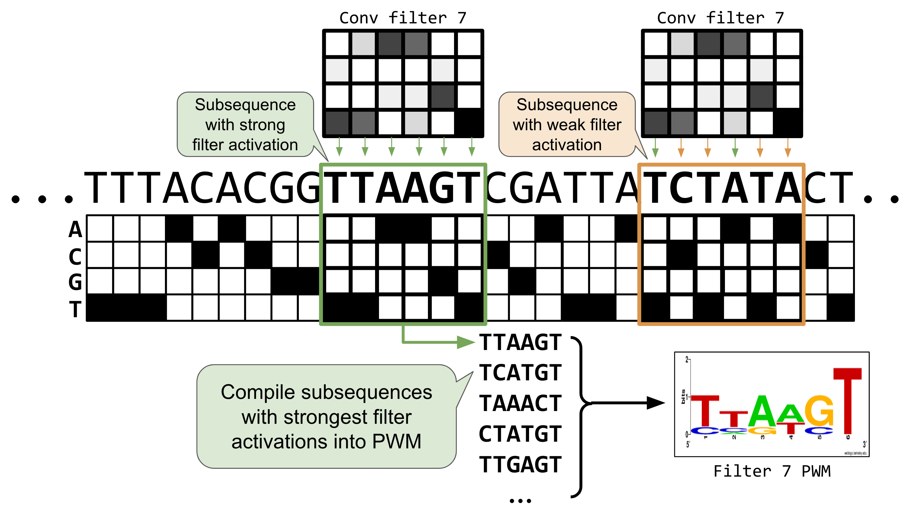

[Jupyter notebook in Colab](https://drive.google.com/file/d/1PMpVZ4h4cpQyyYMmnIDQg7HeGfKxgpHV/view?usp=sharing)

> **Note:** If the notebook doesn't render correctly, click **Open with → Google Colaboratory** in the top-right of the Google Drive preview. 

Originally created by Erin Wilson ([source](https://github.com/erinhwilson/dna-pytorch-tutorial)). Adapted by Haky Im and Ran Blekhman for GENE 46100.

## Building on notebook-02

In notebook-02 you built a CNN that detects a spike pattern in a numeric signal. This notebook applies the **same architecture** to DNA sequences. The key differences:

| | Notebook-02 | This notebook |
|---|---|---|
| **Input** | 1-channel numeric signal | 4-channel one-hot DNA (A/C/G/T) |
| **Task** | Classification (spike yes/no) | Regression (predict a score) |
| **Pattern** | Fixed spike shape | Sequence motifs (TAT, GCG) |
| **Batching** | Full dataset in one pass | Mini-batches via `DataLoader` |
| **Filters reveal** | Spike-shaped weight vectors | Sequence logos |

Everything else — `Conv1d`, ReLU, pooling, the training loop, filter visualization — carries over directly.

## Install and load packages

```{python}
if False:
    %pip install seaborn matplotlib logomaker
    %pip install scikit-learn plotnine tqdm pandas numpy
    %pip install torch torchvision torchmetrics
```

```{python}
from collections import defaultdict
from itertools import product
import matplotlib.pyplot as plt
import numpy as np
import pandas as pd
import random
import torch
from torch import nn
import torch.nn.functional as F
from sklearn.model_selection import train_test_split

if torch.backends.mps.is_available():
    torch.set_default_dtype(torch.float32)
    print("Set default to float32 for MPS compatibility")
```

```{python}
def set_seed(seed: int = 42) -> None:
    """Set random seeds for reproducibility across all libraries."""
    np.random.seed(seed)
    random.seed(seed)
    torch.manual_seed(seed)
    if torch.backends.mps.is_available():
        torch.mps.manual_seed(seed)
    elif torch.cuda.is_available():
        torch.cuda.manual_seed(seed)
        torch.backends.cudnn.deterministic = True
        torch.backends.cudnn.benchmark = False
    print(f"Random seed set as {seed}")

set_seed(17)
```

Choose the best available device — GPU training is faster but the dataset here is small enough for CPU.

```{python}
DEVICE = torch.device('mps' if torch.backends.mps.is_available()
                     else 'cuda' if torch.cuda.is_available()
                     else 'cpu')
DEVICE
```

# Part 1: Generate Synthetic DNA Data {#s1}

In real applications, we'd predict binding scores, expression levels, or chromatin accessibility from DNA. Here we design a simple scoring rule so we can **verify** that our PyTorch pipeline works before scaling to real biology.

**Scoring rule for 8-mers:**

- Each nucleotide contributes a base score: A = 20, C = 17, G = 14, T = 11
- The sequence score is the **mean** of its nucleotide scores
- Motif bonus: **+10** if `TAT` appears anywhere, **−10** if `GCG` appears

This creates three groups of sequences (no motif, TAT, GCG) — easy for us to inspect, and it tests whether the model can learn **local patterns** (motifs) beyond single-nucleotide effects.


```{python}
def kmers(k):
    """Generate all possible k-mers of length k."""
    return [''.join(x) for x in product(['A','C','G','T'], repeat=k)]
```

```{python}
seqs8 = kmers(8)
print('Total 8-mers:', len(seqs8))
```

```{python}
score_dict = {'A': 20, 'C': 17, 'G': 14, 'T': 11}

def score_seqs_motif(seqs):
    """Score each sequence: mean nucleotide score ± motif bonuses."""
    data = []
    for seq in seqs:
        score = np.mean([score_dict[base] for base in seq], dtype=np.float32)
        if 'TAT' in seq:
            score += 10
        if 'GCG' in seq:
            score -= 10
        data.append([seq, score])
    return pd.DataFrame(data, columns=['seq', 'score'])
```

```{python}
mer8 = score_seqs_motif(seqs8)
mer8.head()
```

Spot-check a few sequences with motifs to confirm the scoring logic:

```{python}
mer8[mer8['seq'].isin(['TGCGTTTT', 'CCCCCTAT'])]
```

## Visualize the score distribution

> **Discuss:** The three-peaked histogram confirms our scoring rule: center peak (no motif), right peak (TAT bonus), left peak (GCG penalty).

```{python}
plt.hist(mer8['score'].values, bins=20)
plt.title("8-mer score distribution")
plt.xlabel("Sequence score", fontsize=14)
plt.ylabel("Count", fontsize=14)
plt.show()
```

## Question 1

Modify the scoring function to create a more complex pattern. Instead of giving fixed bonuses for "TAT" and "GCG", implement a position-dependent scoring where a motif gets a higher bonus if it appears at the beginning of the sequence compared to the end. How does this change the distribution of scores?

# Part 2: Prepare Data for PyTorch {#s2}

## One-hot encoding: turning DNA into numbers

In notebook-02, our input was a 1-channel numeric signal. DNA is a string of letters, so we need to convert it. A naive approach — encoding A=0, C=1, G=2, T=3 — would imply a false ordering (A < C < G < T). No base is "more than" another. **One-hot encoding** avoids this by mapping each nucleotide to a unit vector in 4D space, making all bases equidistant:

- A → [1, 0, 0, 0], C → [0, 1, 0, 0], G → [0, 0, 1, 0], T → [0, 0, 0, 1]

An 8-mer becomes an (8 × 4) matrix — equivalent to a **4-channel signal of length 8**. This is exactly the input shape `Conv1d` expects, with `in_channels=4` instead of `in_channels=1`.


```{python}
def one_hot_encode(seq):
    """One-hot encode a DNA sequence into a (seq_len, 4) numpy array."""
    allowed = set("ACTGN")
    if not set(seq).issubset(allowed):
        invalid = set(seq) - allowed
        raise ValueError(f"Invalid characters in sequence: {invalid}")

    nuc_d = {'A': [1.0, 0.0, 0.0, 0.0],
             'C': [0.0, 1.0, 0.0, 0.0],
             'G': [0.0, 0.0, 1.0, 0.0],
             'T': [0.0, 0.0, 0.0, 1.0],
             'N': [0.0, 0.0, 0.0, 0.0]}

    return np.array([nuc_d[x] for x in seq], dtype=np.float32)
```

```{python}
print("AAAAAAAA:\n", one_hot_encode("AAAAAAAA"))
```

```{python}
s = one_hot_encode("AGGTACCT")
print("AGGTACCT:\n", s)
print("Shape:", s.shape)
```

## Train / validation / test split

We use the same `train_test_split` from sklearn as in notebook-02. The split ratios (64% train, 16% val, 20% test) ensure each set contains examples from all three score groups.

```{python}
train_df, test_df = train_test_split(mer8, test_size=0.2, random_state=42)
train_df, val_df = train_test_split(train_df, test_size=0.2, random_state=42)

print("Train:", train_df.shape)
print("Val:  ", val_df.shape)
print("Test: ", test_df.shape)
```

Verify that train, val, and test sets cover the full score distribution:

```{python}
def plot_train_test_hist(train_df, val_df, test_df, bins=20):
    plt.hist(train_df['score'].values, bins=bins, label='train', alpha=0.5)
    plt.hist(val_df['score'].values, bins=bins, label='val', alpha=0.75)
    plt.hist(test_df['score'].values, bins=bins, label='test', alpha=0.4)
    plt.legend()
    plt.xlabel("Sequence score", fontsize=14)
    plt.ylabel("Count", fontsize=14)
    plt.show()
```

```{python}
plot_train_test_hist(train_df, val_df, test_df)
```

## Dataset and DataLoader

In notebook-02 we passed the entire dataset as one tensor. With larger datasets that won't fit in memory, so PyTorch provides `Dataset` (defines how to fetch one sample) and `DataLoader` (handles batching, shuffling, and parallel loading). This is the standard pattern you'll see in every PyTorch project.

```{python}
from torch.utils.data import Dataset, DataLoader
```

```{python}
class SeqDatasetOHE(Dataset):
    """Dataset that one-hot encodes DNA sequences on construction."""
    def __init__(self, df, seq_col='seq', target_col='score'):
        self.seqs = list(df[seq_col].values)
        self.seq_len = len(self.seqs[0])
        self.ohe_seqs = torch.stack([torch.tensor(one_hot_encode(x)) for x in self.seqs])
        self.labels = torch.tensor(list(df[target_col].values)).unsqueeze(1)

    def __len__(self):
        return len(self.seqs)

    def __getitem__(self, idx):
        return self.ohe_seqs[idx], self.labels[idx]
```

```{python}
def build_dataloaders(train_df, test_df, seq_col='seq', target_col='score',
                      batch_size=128, shuffle=True):
    """Create DataLoaders from train and test DataFrames."""
    train_ds = SeqDatasetOHE(train_df, seq_col=seq_col, target_col=target_col)
    test_ds = SeqDatasetOHE(test_df, seq_col=seq_col, target_col=target_col)
    train_dl = DataLoader(train_ds, batch_size=batch_size, shuffle=shuffle)
    test_dl = DataLoader(test_ds, batch_size=batch_size)
    return train_dl, test_dl
```

```{python}
train_dl, val_dl = build_dataloaders(train_df, val_df)
```

# Part 3: Define the Models {#s3}

We compare two architectures to see why convolution matters for motif detection:

- **Linear model** — learns a weight for each nucleotide at each position. It can capture single-nucleotide effects (e.g. "A contributes +20") but **cannot detect motifs**, because it has no way to recognize that specific adjacent nucleotides matter.
- **CNN model** — uses sliding filters of width 3, exactly the length of our motifs (TAT, GCG). Each filter can learn a local pattern regardless of where it appears — the same **translation invariance** from notebook-02. In fact, a CNN filter sliding over one-hot DNA is mathematically equivalent to scoring with a **Position Weight Matrix (PWM)** — but the weights are *learned from data*, not hand-designed.

```{python}
class DNA_Linear(nn.Module):
    def __init__(self, seq_len):
        super().__init__()
        self.seq_len = seq_len
        self.lin = nn.Linear(4 * seq_len, 1)

    def forward(self, xb):
        xb = xb.view(xb.shape[0], self.seq_len * 4)
        return self.lin(xb)


class DNA_CNN(nn.Module):
    def __init__(self, seq_len, num_filters=32, kernel_size=3):
        super().__init__()
        self.seq_len = seq_len
        self.conv = nn.Conv1d(4, num_filters, kernel_size=kernel_size)
        self.relu = nn.ReLU(inplace=True)
        self.linear = nn.Linear(num_filters * (seq_len - kernel_size + 1), 1)

    def forward(self, xb):
        xb = xb.permute(0, 2, 1)   # (batch, seq_len, 4) → (batch, 4, seq_len)
        x = self.relu(self.conv(xb))
        x = x.flatten(1)
        return self.linear(x)
```

# Part 4: Training Loop {#s4}

The training loop follows the same structure as notebook-02 — forward pass, compute loss, backpropagate, update weights — but now processes **mini-batches** from the DataLoader instead of the full dataset at once.

We use **MSE loss** (regression) instead of cross-entropy (classification), and **SGD** as the optimizer.

```{python}
def train_model(model, train_dl, val_dl, device, lr=0.01, epochs=50):
    """Train a model and return loss histories."""
    optimizer = torch.optim.SGD(model.parameters(), lr=lr)
    loss_fn = nn.MSELoss()
    train_losses, val_losses = [], []

    for epoch in range(epochs):
        # --- Training ---
        model.train()                      # enable training mode (affects dropout, batchnorm)
        batch_losses, batch_sizes = [], []
        for xb, yb in train_dl:
            xb, yb = xb.to(device), yb.to(device)  # move batch to GPU/CPU
            pred = model(xb.float())       # forward pass: input → prediction
            loss = loss_fn(pred, yb.float())  # compute loss: how wrong are we?
            optimizer.zero_grad()          # clear gradients from previous batch
            loss.backward()                # backprop: compute gradient of loss w.r.t. weights
            optimizer.step()               # update weights using gradients
            batch_losses.append(loss.item())
            batch_sizes.append(len(xb))
        train_loss = np.average(batch_losses, weights=batch_sizes)
        train_losses.append(train_loss)

        # --- Validation (no gradient updates) ---
        model.eval()                       # disable training-only layers
        with torch.no_grad():              # skip gradient tracking (saves memory)
            vl, ns = [], []
            for xb, yb in val_dl:
                xb, yb = xb.to(device), yb.to(device)
                loss = loss_fn(model(xb.float()), yb.float())
                vl.append(loss.item())
                ns.append(len(xb))
        val_loss = np.average(vl, weights=ns)
        val_losses.append(val_loss)

        print(f"E{epoch} | train loss: {train_loss:.3f} | val loss: {val_loss:.3f}")

    return train_losses, val_losses
```

# Part 5: Train and Compare {#s5}

## Linear model

```{python}
seq_len = len(train_df['seq'].values[0])

model_lin = DNA_Linear(seq_len).type(torch.float32).to(DEVICE)
lin_train_losses, lin_val_losses = train_model(model_lin, train_dl, val_dl, DEVICE)
```

```{python}
def quick_loss_plot(data_label_list, loss_type="MSE Loss"):
    for i, (train_data, test_data, label) in enumerate(data_label_list):
        plt.plot(train_data, linestyle='--', color=f"C{i}", label=f"{label} Train")
        plt.plot(test_data, color=f"C{i}", label=f"{label} Val", linewidth=3.0)
    plt.legend(bbox_to_anchor=(1, 1), loc='upper left')
    plt.ylabel(loss_type)
    plt.xlabel("Epoch")
    plt.show()
```

```{python}
lin_data_label = (lin_train_losses, lin_val_losses, "Linear")
quick_loss_plot([lin_data_label])
```

> **Discuss:** The linear model plateaus quickly. This is an **architecture** problem, not an optimizer problem — no amount of tuning the learning rate will help. The model simply cannot represent motif-level patterns.

## CNN model

```{python}
model_cnn = DNA_CNN(seq_len).to(DEVICE)
cnn_train_losses, cnn_val_losses = train_model(model_cnn, train_dl, val_dl, DEVICE)
```

```{python}
cnn_data_label = (cnn_train_losses, cnn_val_losses, "CNN")
quick_loss_plot([lin_data_label, cnn_data_label])
```

> **Discuss:** The CNN loss drops much further — its sliding filters can capture the 3-mer motifs that the linear model cannot.

## Spot-check predictions

Let's compare what each model predicts for specific sequences to understand *why* the linear model fails:

```{python}
oracle = dict(mer8[['seq', 'score']].values)

def quick_seq_pred(model, desc, seqs, oracle):
    print(f"__{desc}__")
    for dna in seqs:
        s = torch.tensor(one_hot_encode(dna)).unsqueeze(0).to(DEVICE)
        pred = model(s.float())
        actual = oracle[dna]
        diff = pred.item() - actual
        print(f"{dna}: pred:{pred.item():.3f} actual:{actual:.3f} ({diff:.3f})")

def quick_8mer_pred(model, oracle):
    groups = [
        ("poly-X seqs",      ['AAAAAAAA', 'CCCCCCCC', 'GGGGGGGG', 'TTTTTTTT']),
        ("other seqs",       ['AACCAACA', 'CCGGTGAG', 'GGGTAAGG', 'TTTCGTTT']),
        ("with TAT motif",   ['TATAAAAA', 'CCTATCCC', 'GTATGGGG', 'TTTATTTT']),
        ("with GCG motif",   ['AAGCGAAA', 'CGCGCCCC', 'GGGCGGGG', 'TTGCGTTT']),
        ("both TAT and GCG", ['ATATGCGA', 'TGCGTATT']),
    ]
    for desc, seqs in groups:
        quick_seq_pred(model, desc, seqs, oracle)
        print()
```

```{python}
quick_8mer_pred(model_lin, oracle)
```

> **Discuss:** The linear model underpredicts G-rich sequences and overpredicts T-rich ones. Why? It learned that G's tend to appear in low-scoring sequences (because of GCG) and T's in high-scoring ones (because of TAT). But **it's the 3-mer context that matters, not individual nucleotides** — `GCG` is penalized while `GAG` is not. The linear model cannot make this distinction.

```{python}
quick_8mer_pred(model_cnn, oracle)
```

> **Discuss:** The CNN handles both motif and non-motif sequences well, because its width-3 filters can detect the specific 3-mer patterns.

## Question 2

Compare the performance of the Linear and CNN models by using different learning rates. First run both models with higher learning rates (0.05, 0.1) and lower learning rates (0.005, 0.001), then create loss plots showing:

- Linear model with these learning rates
- CNN model with these learning rates

Then analyze your results by answering:

1. How does changing the learning rate affect convergence for each model?
2. Which model is more sensitive to learning rate changes, and why?
3. Based on your analysis, what learning rate would you recommend for each model type, and why?

# Part 6: Evaluate on Test Set {#s6}

The test set was never seen during training — it's our honest estimate of how the model would perform on new sequences.

```{python}
import altair as alt
from sklearn.metrics import r2_score
```

```{python}
def scatter_plot(model_name, df, r2):
    """Scatter actual vs predicted scores with a y=x reference line."""
    plt.scatter(df['truth'].values, df['pred'].values, alpha=0.2)
    xpoints = ypoints = plt.xlim()
    plt.plot(xpoints, ypoints, linestyle='--', color='k', lw=2, scalex=False, scaley=False)
    plt.ylim(xpoints)
    plt.ylabel("Predicted Score", fontsize=14)
    plt.xlabel("Actual Score", fontsize=14)
    plt.title(f"{model_name} (R² = {r2:.3f})", fontsize=20)
    plt.show()


def alt_scatter_plot(model_name, df, r2):
    """Interactive scatter plot with altair — hover to see sequences."""
    import os
    os.makedirs('alt_out', exist_ok=True)
    plot_df = pd.DataFrame({
        'truth': df['truth'].astype(float),
        'pred': df['pred'].astype(float),
        'seq': df['seq'].astype(str)
    })
    chart = alt.Chart(plot_df).mark_point().encode(
        x=alt.X('truth', type='quantitative', title='Actual Score'),
        y=alt.Y('pred', type='quantitative', title='Predicted Score'),
        tooltip=['seq']
    ).properties(title=f'{model_name} (R² = {r2:.3f})')
    chart.save(f'alt_out/scatter_plot_{model_name}.html')
    display(chart)


def scatter_pred(models, seqs, oracle, interactive=False):
    """Generate scatter plots for a list of (name, model) pairs."""
    for model_name, model in models:
        print(f"Running {model_name}")
        data = []
        for dna in seqs:
            s = torch.tensor(one_hot_encode(dna)).unsqueeze(0).to(DEVICE)
            actual = oracle[dna]
            pred = model(s.float())
            data.append([dna, actual, pred.item()])
        df = pd.DataFrame(data, columns=['seq', 'truth', 'pred'])
        r2 = r2_score(df['truth'], df['pred'])
        if interactive:
            alt_scatter_plot(model_name, df, r2)
        else:
            scatter_plot(model_name, df, r2)
```

```{python}
seqs = test_df['seq'].values
models = [("Linear", model_lin), ("CNN", model_cnn)]
scatter_pred(models, seqs, oracle)
```

> **Discuss:** In a perfect model, all points fall on the y=x line. The linear model shows three distinct bands (it can't resolve within-band variation caused by motifs), while the CNN clusters tightly around the diagonal.

```{python}
alt.data_transformers.disable_max_rows()
scatter_pred(models, seqs, oracle, interactive=True)
```

> **Discuss:** Hover over outlier points in the interactive plot. The CNN's largest errors tend to be sequences with **multiple** instances of a motif — our scoring function only gives one bonus regardless of count, but the model reasonably guesses that more motifs should mean a stronger effect.

## Question 3

Design an approach to improve the model's prediction accuracy, particularly focusing on the sequences where the current model performs poorly:

1. After identifying sequences where the CNN model has high prediction errors, propose and implement a modification to either the model architecture, the loss function, the training process, or the data representation
2. Retrain the model with your modifications
3. Create comparative visualizations (such as scatter plots, error histograms, or other appropriate plots) to demonstrate the impact of your changes
4. Analyze your results by discussing how your modification addresses the specific weaknesses you identified. What are the trade-offs involved in your approach?

# Part 7: Visualize Convolutional Filters {#s7}

In notebook-02 we plotted filter weights as bar charts. With DNA, we can go further: for each filter, we collect the subsequences that **activate** it most strongly, then display them as a **sequence logo** — the same representation used for transcription factor binding motifs.

Positions with tall letters have high information content (the filter is selective), while flat positions mean the filter doesn't care which nucleotide appears there.

```{python}
import logomaker
```

```{python}
def get_conv_layers_from_model(model):
    """Extract convolutional layers and their weights from a model."""
    model_weights, conv_layers, bias_weights = [], [], []
    for child in model.children():
        if isinstance(child, nn.Conv1d):
            model_weights.append(child.weight)
            conv_layers.append(child)
            bias_weights.append(child.bias)
        elif isinstance(child, nn.Sequential):
            for subchild in child:
                if isinstance(subchild, nn.Conv1d):
                    model_weights.append(subchild.weight)
                    conv_layers.append(subchild)
                    bias_weights.append(subchild.bias)
    print(f"Total convolutional layers: {len(conv_layers)}")
    return conv_layers, model_weights, bias_weights


def view_filters(model_weights, num_cols=8):
    """Display raw filter weight heatmaps."""
    weights = model_weights[0]
    num_filt = weights.shape[0]
    filt_width = weights[0].shape[1]
    num_rows = int(np.ceil(num_filt / num_cols))

    plt.figure(figsize=(20, 17))
    for i, filt in enumerate(weights):
        ax = plt.subplot(num_rows, num_cols, i + 1)
        ax.imshow(filt.cpu().detach(), cmap='gray')
        ax.set_yticks(np.arange(4))
        ax.set_yticklabels(['A', 'C', 'G', 'T'])
        ax.set_xticks(np.arange(filt_width))
        ax.set_title(f"Filter {i}")
    plt.tight_layout()
    plt.show()
```

```{python}
conv_layers, model_weights, bias_weights = get_conv_layers_from_model(model_cnn)
view_filters(model_weights)
```



The raw heatmaps show what each filter "looks for," but they're hard to read. Let's convert them to sequence logos by running test sequences through the filters and collecting which subsequences cause high activation:

```{python}
def get_conv_output_for_seq(seq, conv_layer):
    """Run a sequence through a conv layer and return filter activations."""
    seq_t = torch.tensor(one_hot_encode(seq)).unsqueeze(0).permute(0, 2, 1).to(DEVICE)
    with torch.no_grad():
        return conv_layer(seq_t.float())[0]


def get_filter_activations(seqs, conv_layer, act_thresh=0):
    """Collect subsequences that activate each filter above a threshold,
    accumulating them into a count matrix (PWM) per filter."""
    num_filters = conv_layer.out_channels
    filt_width = conv_layer.kernel_size[0]
    filter_pwms = {i: torch.zeros(4, filt_width) for i in range(num_filters)}

    print(f"Num filters: {num_filters}, filter width: {filt_width}")

    for seq in seqs:
        res = get_conv_output_for_seq(seq, conv_layer)
        for filt_id, act_vec in enumerate(res):
            for pos in torch.where(act_vec > act_thresh)[0]:
                pos = pos.item()
                subseq = seq[pos:pos + filt_width]
                subseq_tensor = torch.tensor(one_hot_encode(subseq)).T
                filter_pwms[filt_id] += subseq_tensor

    return filter_pwms


def view_filters_and_logos(model_weights, filter_activations, num_cols=8):
    """Display filter heatmaps paired with their sequence logos."""
    weights = model_weights[0].squeeze(1)
    num_filts = len(filter_activations)
    num_rows = int(np.ceil(num_filts / num_cols)) * 2 + 1

    plt.figure(figsize=(20, 17))
    j = 0
    for i, filt in enumerate(weights):
        if i % num_cols == 0:
            j += num_cols

        ax1 = plt.subplot(num_rows, num_cols, i + j + 1)
        ax1.imshow(filt.cpu().detach(), cmap='gray')
        ax1.set_yticks(np.arange(4))
        ax1.set_yticklabels(['A', 'C', 'G', 'T'])
        ax1.set_xticks(np.arange(weights.shape[2]))
        ax1.set_title(f"Filter {i}")

        ax2 = plt.subplot(num_rows, num_cols, i + j + 1 + num_cols)
        filt_df = pd.DataFrame(filter_activations[i].T.numpy(), columns=['A', 'C', 'G', 'T'])
        filt_df_info = logomaker.transform_matrix(filt_df, from_type='counts', to_type='information')
        logo = logomaker.Logo(filt_df_info, ax=ax2)
        ax2.set_ylim(0, 2)
        ax2.set_title(f"Filter {i}")

    plt.tight_layout()
```

```{python}
some_seqs = random.choices(seqs, k=3000)

filter_activations = get_filter_activations(some_seqs, conv_layers[0])
view_filters_and_logos(model_weights, filter_activations)
```

### With a stronger activation threshold

Setting `act_thresh=1` keeps only the strongest activations, making the logos crisper. Some filters may have no matches above this threshold.

```{python}
filter_activations = get_filter_activations(some_seqs, conv_layers[0], act_thresh=1)
view_filters_and_logos(model_weights, filter_activations)
```

> **Discuss:** You should see some filters that clearly learned TAT and GCG, while others capture subtler nucleotide preferences. In deeper models with multiple conv layers, first-layer filters can combine in complex ways, so they may not always correspond to recognizable motifs ([Koo and Eddy, 2019](https://journals.plos.org/ploscompbiol/article?id=10.1371/journal.pcbi.1007560)).

# Summary

This notebook showed the full pipeline from DNA sequences to trained CNN:

| Step | What we did | Why |
|------|-------------|-----|
| Scoring rule | Designed a synthetic task with motif bonuses | Verifiable ground truth before tackling real biology |
| One-hot encoding | A/C/G/T → 4-channel input | `Conv1d` needs numeric input; 4 channels = 4 nucleotides |
| DataLoader | Batched training with `Dataset` + `DataLoader` | Scales to datasets too large for memory |
| Linear vs CNN | Compared a position-only model to a motif-capable model | Shows that local context (convolution) is essential for motif detection |
| Scatter plots | Predicted vs actual scores on held-out test set | Honest evaluation; reveals systematic errors |
| Filter → logo | Visualized what each filter learned as a sequence logo | Interpretability — do learned filters match known motifs? |

## Further reading

Foundational papers on CNNs applied to DNA:

- DeepBind: [Alipanahi et al 2015](https://www.nature.com/articles/nbt.3300)
- DeepSEA: [Zhou and Troyanskaya 2015](https://www.ncbi.nlm.nih.gov/pmc/articles/PMC4768299/)
- Basset: [Kelley et al 2016](https://pubmed.ncbi.nlm.nih.gov/27197224/)
