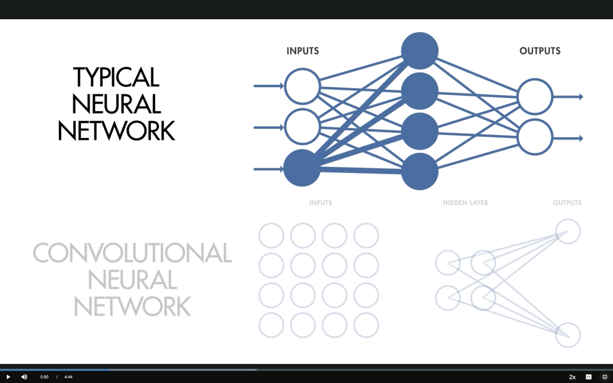
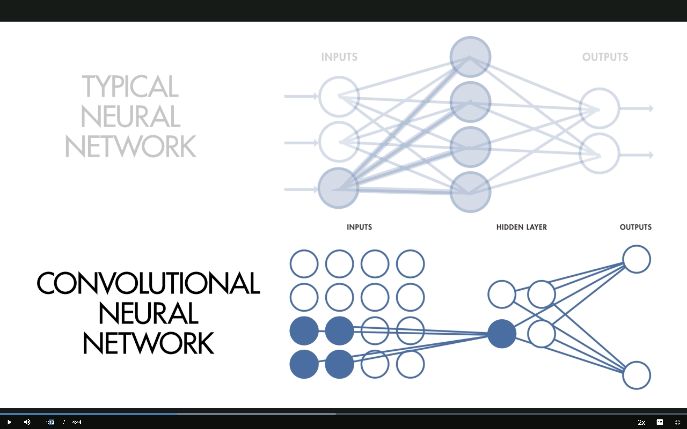
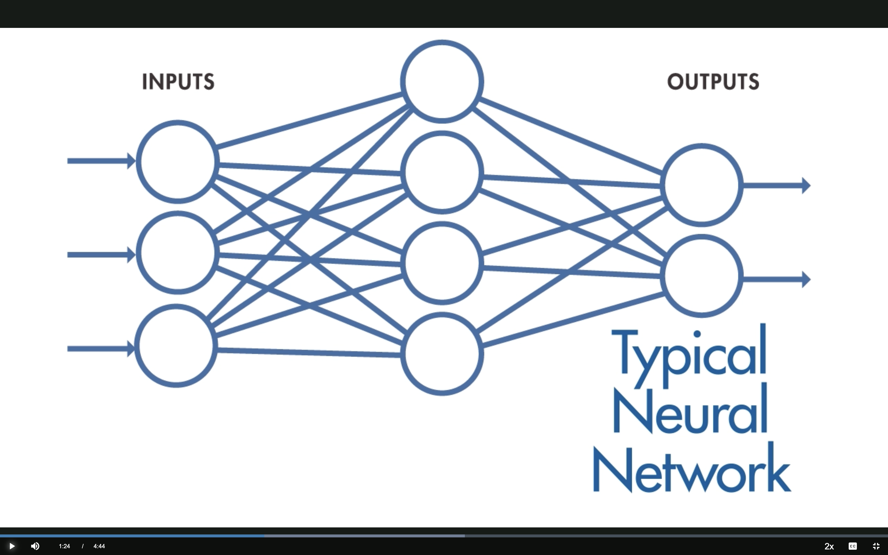
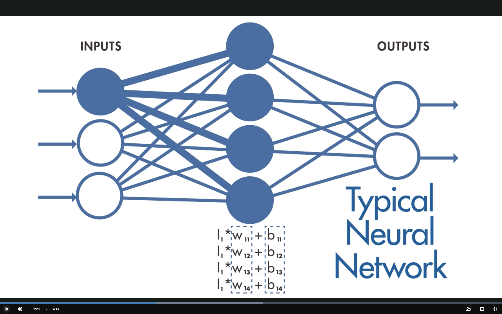
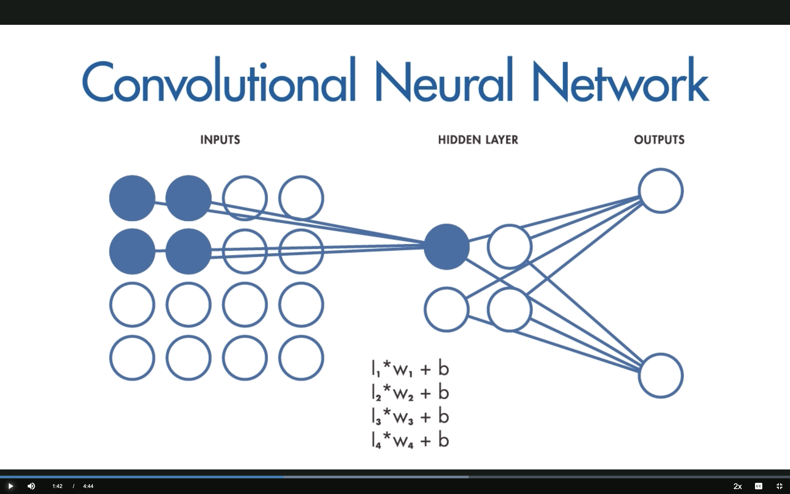
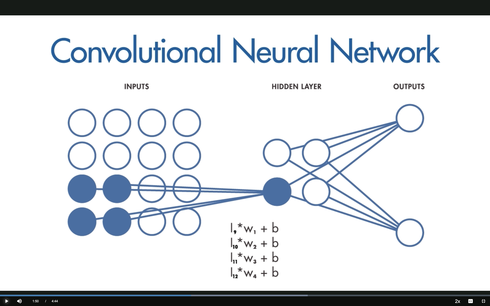
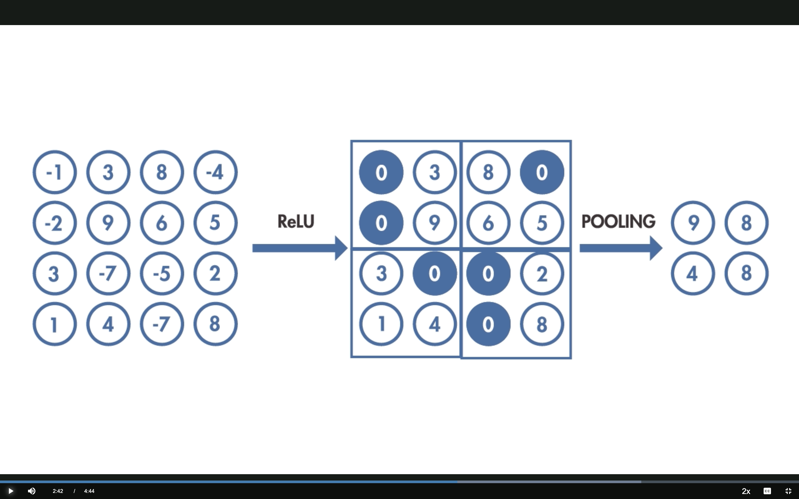
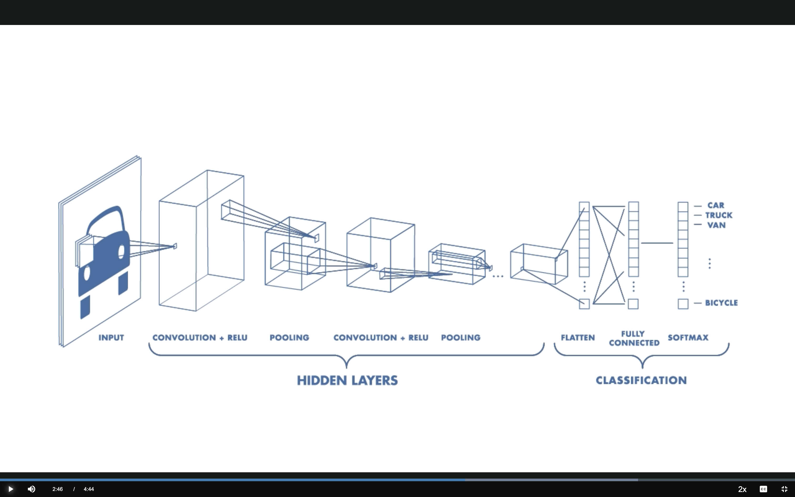
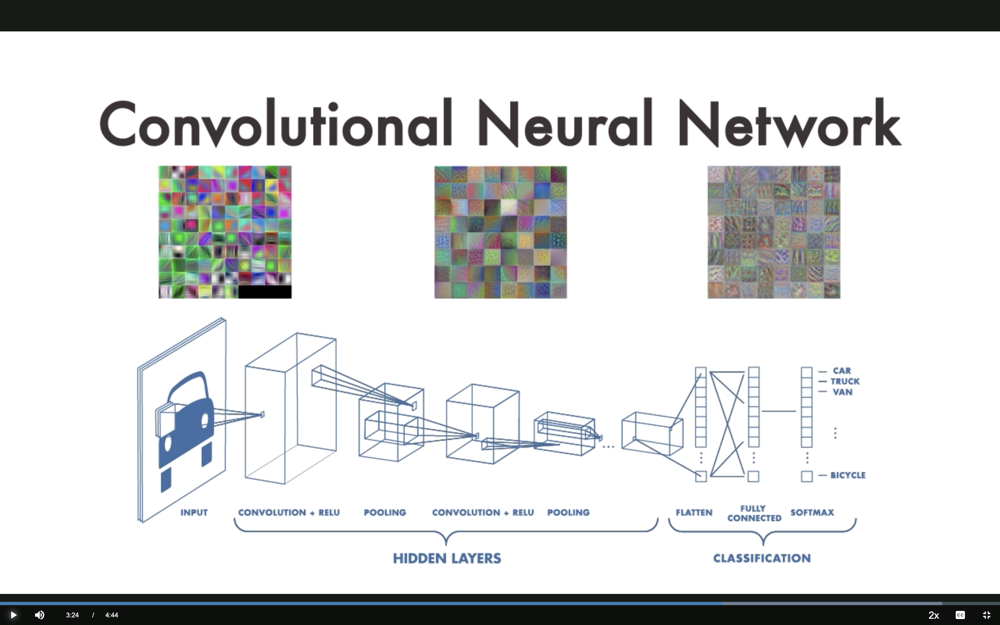

## What is a CNN?

A **convolutional neural network (CNN)** is a network architecture for deep learning that learns directly from data (images, sequences, ...).

. . .

A CNN is made up of several **layers** that process and transform an input to produce an output.

. . .

### Applications

- Scene classification
- Object detection & segmentation
- Image processing
- **DNA sequence analysis** (our focus!)

::: {.source-credit}
Based on [MathWorks: Introduction to Deep Learning — What Are CNNs?](https://www.mathworks.com/videos/introduction-to-deep-learning-what-are-convolutional-neural-networks--1489512765771.html)
:::

---

## Three Key Concepts

::: {.source-credit}
Source: [MathWorks — What Are CNNs?](https://www.mathworks.com/videos/introduction-to-deep-learning-what-are-convolutional-neural-networks--1489512765771.html)
:::

::: {.incremental}

1. **Local receptive fields**
2. **Shared weights and biases**
3. **Activation and pooling**

:::

# Part 1: How CNNs Work {background-color="#1e3a5f" style="color:white;"}

---

## 1 — Local Receptive Fields

:::: {.columns}

::: {.column width="50%"}
{width="100%"}
:::

::: {.column width="50%" .fragment}
{width="100%"}
:::

::::

::: {.source-credit}
Source: [MathWorks — What Are CNNs?](https://www.mathworks.com/videos/introduction-to-deep-learning-what-are-convolutional-neural-networks--1489512765771.html)
:::

---

## Typical NN: Fully Connected

{fig-align="center" width="85%"}

Every input neuron connects to every hidden neuron — each hidden neuron has **its own set of weights**.

::: {.source-credit}
Source: [MathWorks — What Are CNNs?](https://www.mathworks.com/videos/introduction-to-deep-learning-what-are-convolutional-neural-networks--1489512765771.html)
:::

---

## Typical NN: Weights

{fig-align="center" width="85%"}

Hidden neuron output: $h_j = \sum_i I_i \cdot W_{ij} + b_j$

All $N \times M$ weights are **independent** — expensive and no spatial structure.

::: {.source-credit}
Source: [MathWorks — What Are CNNs?](https://www.mathworks.com/videos/introduction-to-deep-learning-what-are-convolutional-neural-networks--1489512765771.html)
:::

---

## CNN: Local Receptive Fields

{fig-align="center" width="85%"}

Only a **small region** of the input connects to each hidden neuron.

The hidden neuron computes: $h = \sum_k I_k \cdot w_k + b$ using a **small filter**.

::: {.source-credit}
Source: [MathWorks — What Are CNNs?](https://www.mathworks.com/videos/introduction-to-deep-learning-what-are-convolutional-neural-networks--1489512765771.html)
:::

---

## CNN: The Filter Slides

{fig-align="center" width="85%"}

The **same filter** (same weights) slides across the input to create a **feature map**.

. . .

This sliding operation is **convolution** — hence the name *convolutional* neural network.

::: {.source-credit}
Source: [MathWorks — What Are CNNs?](https://www.mathworks.com/videos/introduction-to-deep-learning-what-are-convolutional-neural-networks--1489512765771.html)
:::

---

## 2 — Shared Weights and Biases

**Key difference from a typical NN:** the weights and biases are the **same** for all hidden neurons in a given layer.

. . .

This means every neuron in a layer is **detecting the same feature** (e.g., an edge or a blob) at **different locations**.

. . .

Compare the equations:

| | Typical NN | CNN |
|---|---|---|
| Weights | $I_i \cdot W_{ij} + b_j$ (unique per neuron) | $I_k \cdot w_k + b$ (shared) |
| Parameters | $N \times M$ | Filter size only |

::: {.source-credit}
Source: [MathWorks — What Are CNNs?](https://www.mathworks.com/videos/introduction-to-deep-learning-what-are-convolutional-neural-networks--1489512765771.html)
:::

---

## Translation Invariance

Because weights are shared, CNNs are **tolerant to translation** of objects in the input.

. . .

> A network trained to recognize cats will find the cat **wherever** it appears in the image.

. . .

**Genomics analogy:** A CNN trained to recognize a TF binding motif will find it **regardless of position** in the DNA sequence.

::: {.source-credit}
Source: [MathWorks — What Are CNNs?](https://www.mathworks.com/videos/introduction-to-deep-learning-what-are-convolutional-neural-networks--1489512765771.html)
:::

---

## 3 — Activation and Pooling

{fig-align="center" width="85%"}

. . .

**ReLU:** $f(x) = \max(0, x)$ — negative values become 0, positive values pass through.

**Max Pooling:** take the **maximum** value in each 2×2 block — reduces dimensionality while keeping the strongest activations.

::: {.source-credit}
Source: [MathWorks — What Are CNNs?](https://www.mathworks.com/videos/introduction-to-deep-learning-what-are-convolutional-neural-networks--1489512765771.html)
:::

# Part 2: Putting It Together {background-color="#1e3a5f" style="color:white;"}

---

## Putting It All Together

{fig-align="center" width="90%"}

INPUT → CONV+RELU → POOLING → CONV+RELU → POOLING → FLATTEN → FULLY CONNECTED → SOFTMAX

::: {.source-credit}
Source: [MathWorks — What Are CNNs?](https://www.mathworks.com/videos/introduction-to-deep-learning-what-are-convolutional-neural-networks--1489512765771.html)
:::

---

## Hierarchical Feature Learning

{fig-align="center" width="90%"}

Each layer learns progressively more complex features:

| Layer depth | Vision | Genomics |
|-------------|--------|----------|
| Early layers | Edges, colors | Short k-mers |
| Middle layers | Textures, shapes | Motifs (e.g., TATA box) |
| Deep layers | Object parts, objects | Motif combinations, regulatory logic |

::: {.source-credit}
Source: [MathWorks — What Are CNNs?](https://www.mathworks.com/videos/introduction-to-deep-learning-what-are-convolutional-neural-networks--1489512765771.html)
:::

# Part 3: Using CNNs in Practice {background-color="#1e3a5f" style="color:white;"}

---

## Three Ways to Use CNNs

---

## Method 1 — Train from Scratch

Build and train the entire network on your own data.

. . .

**Pros:** Highly accurate, fully customized

**Cons:**

- Requires hundreds of thousands of labeled examples
- Significant computational resources (GPUs)

. . .

*This is what we do in the TF binding prediction homework.*

::: {.source-credit}
Source: [MathWorks — What Are CNNs?](https://www.mathworks.com/videos/introduction-to-deep-learning-what-are-convolutional-neural-networks--1489512765771.html)
:::

---

## Method 2 — Transfer Learning

Use a model **pre-trained on one task** as the starting point for a related task.

. . .

> Example: A CNN trained to recognize animals can be fine-tuned to distinguish cars from trucks.

. . .

**Pros:** Requires less data and compute

**Genomics example:** Fine-tune a model trained on one TF's binding data to predict binding for a related TF.

::: {.source-credit}
Source: [MathWorks — What Are CNNs?](https://www.mathworks.com/videos/introduction-to-deep-learning-what-are-convolutional-neural-networks--1489512765771.html)
:::

---

## Method 3 — Feature Extraction

Use a **pre-trained CNN's hidden layers** to extract features, then train a simpler model on top.

. . .

> A layer that learned to detect edges is broadly useful across many domains.

. . .

**Pros:** Requires the **least** data and compute

**Genomics example:** Use Enformer embeddings as features for downstream prediction tasks.

::: {.source-credit}
Source: [MathWorks — What Are CNNs?](https://www.mathworks.com/videos/introduction-to-deep-learning-what-are-convolutional-neural-networks--1489512765771.html)
:::

# Part 4: Summary {background-color="#1e3a5f" style="color:white;"}

---

## Summary

| Concept | Key Idea |
|---------|----------|
| Local receptive fields | Small sliding window over input |
| Shared weights | Same filter at every position → translation invariance |
| Activation (ReLU) | Introduce non-linearity |
| Pooling | Reduce dimensionality |
| Hierarchical features | Simple → complex across layers |

---

## Summary

### Three training strategies

1. **From scratch** — most data, most flexibility
2. **Transfer learning** — fine-tune a pretrained model
3. **Feature extraction** — least data needed

---

## From Concepts to Code

We've covered the ideas — now let's build one.

. . .

In the hands-on notebook you will:

::: {.incremental}

1. Implement convolution **by hand** to see exactly what `Conv1d` does
2. Build a small CNN that detects a spike pattern hidden at a random position in a noisy signal
3. Train it and **visualize the learned filters** — do they recover the spike shape?

:::

. . .

This is the same translation-invariance story: the spike can appear **anywhere**, and the CNN finds it with shared weights.

---

## Next Steps

::: {.incremental}

- **Hands-on (notebook-02):** Build a CNN that detects a spike pattern in a numeric signal — same mechanics, simpler setting
- **Then (notebook-03):** Apply the same architecture to DNA sequences with one-hot encoding
- **Key question:** Can a CNN learn to detect regulatory motifs in DNA?

:::
