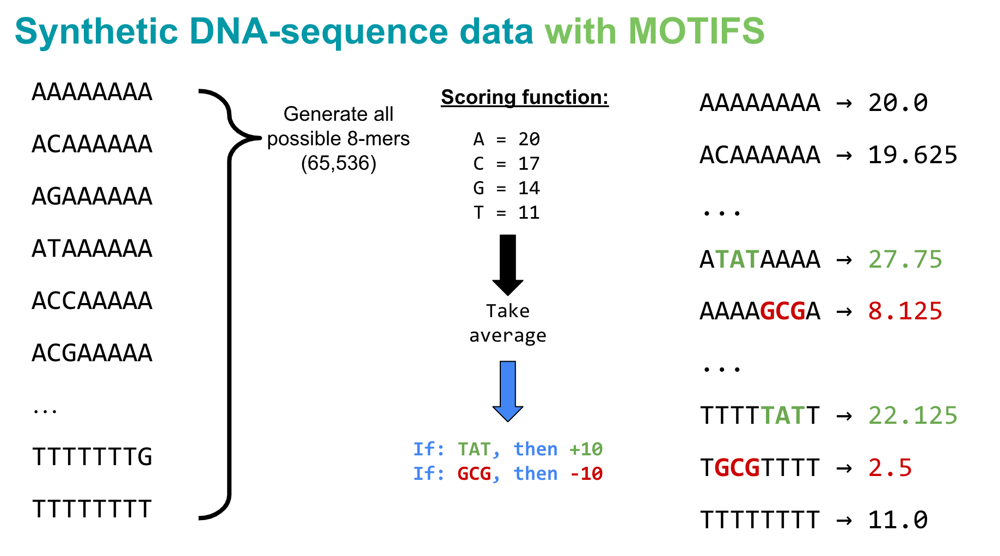
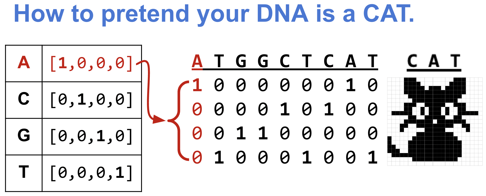

## You Can Train a Neural Network on Numbers

**So far:** gradient descent → MLP → CNNs on numeric data.

. . .

**Today's question:**

> What if the input is a DNA sequence?

. . .

Two new problems to solve:

::: {.incremental}
- DNA is **letters** — networks need numbers
- The patterns we care about (motifs) are **local and position-independent** — a linear model can't see them
:::

---

## Today's Roadmap

::: {.source-credit}
Notebook by [Erin Wilson](https://github.com/erinhwilson/dna-pytorch-tutorial), adapted for GENE 46100 by Haky Im and Ran Blekhman
:::

| Step | What we do |
|------|-----------|
| 1 | Generate synthetic DNA with known scoring rules |
| 2 | One-hot encode sequences → input matrices |
| 3 | Split into train / val / test |
| 4 | Define a Linear and a CNN model |
| 5 | Train both with the same PyTorch loop |
| 6 | Compare with loss curves + scatter plots |
| 7 | Visualize what the CNN learned |

Notebook: [Colab link](https://drive.google.com/file/d/1x1oAP584Z2mXXMwcaZDaRUYENMt_S5pa/view?usp=sharing)

# Part 1: The Task {background-color="#1e3a5f" style="color:white;"}

**Can a model learn to detect a short pattern in DNA?**

---

## A Scoring Rule for 8-mers

We want a task where **we** know the right answer — so we can verify the model found it.

::: {.columns}

:::: {.column width="40%"}

Score each 8-mer by **average nucleotide value**:

| Base | Points |
|------|--------|
| A    | 20     |
| C    | 17     |
| G    | 14     |
| T    | 11     |

::::

:::: {.column width="10%"}
::::

:::: {.column width="50%"}

::: {.fragment}

`AAAAAAAA` → mean(20×8) = **20.0**

<br>

`ACAAAAAA` → mean(20+17+…+20) = **19.625**

:::

::::

:::

---

## Adding Motifs

To simulate regulatory elements, two motifs modify the score:

. . .

::: {.columns}

:::: {.column width="40%"}

**TAT** anywhere in the 8-mer → **+10**

**GCG** anywhere in the 8-mer → **−10**

::::

:::: {.column width="60%"}

{fig-align="center" width="100%"}

::::

:::

. . .

::: {.takehome}
These motifs are **arbitrary** — we designed them so we can verify the model finds the right pattern.
This is our ground truth check before applying CNNs to real biology.
:::

# Part 2: DNA → Numbers {background-color="#1e3a5f" style="color:white;"}

**One-hot encoding**

---

## The Problem: Letters ≠ Numbers

Neural networks compute dot products and gradients — they need a **matrix of numbers**.

. . .

Naive approach: encode A=0, C=1, G=2, T=3

. . .

::: {.columns}

:::: {.column width="50%"}

**Problem:** this implies an ordering

$$A < C < G < T$$

That's false — no base is "more than" another.

::::

:::: {.column width="50%" .fragment}

**Solution:** one-hot encoding

Each base → a **unit vector** in 4D space.

All bases are **equidistant** from each other.

::::

:::

---

## One-Hot Encoding

Each nucleotide becomes a vector of length 4:

```
         A     C     G     T
A  →  [  1     0     0     0  ]
C  →  [  0     1     0     0  ]
G  →  [  0     0     1     0  ]
T  →  [  0     0     0     1  ]
N  →  [  0     0     0     0  ]
```

. . .

A sequence of length 8 becomes a matrix of shape **(8, 4)**:

```
ATGCGT  →  [[1,0,0,0],
             [0,0,0,1],
             [0,0,1,0],
             [0,1,0,0],
             [0,0,1,0],
             [0,0,0,1]]
```

---

## DNA Looks Like an Image

::: {.columns}

:::: {.column width="55%"}

{fig-align="center" width="90%"}

::::

:::: {.column width="45%"}

A one-hot encoded DNA sequence has the same structure as a **grayscale image**:

- Columns = positions in sequence
- Rows = channels (A, C, G, T)
- Values = 0 or 1

:::::{.takehome .fragment}
CNNs were designed for images.
**We can use them directly on DNA.**
:::::

::::

:::

# Part 3: Linear vs CNN {background-color="#1e3a5f" style="color:white;"}

**Why architecture matters**

---

## Model 1: Linear

**Architecture:** flatten the (8, 4) one-hot matrix → 32 numbers → one linear layer → score.

. . .

**What it sees:** which nucleotide is at each absolute position.

**What it can't see:** whether a 3-mer like `TAT` appears *anywhere* in the sequence.

. . .

::: {.takehome}
If `TAT` appears at position 2 vs position 5, the linear model treats these as completely different inputs.
It confuses **correlation** (G predicts low score) with **local pattern** (GCG causes −10).
:::

---

## Model 2: CNN

**Architecture:** 32 filters of width 3, sliding across the sequence → ReLU → flatten → linear layer → score.

. . .

**What it sees:** local 3-mer patterns at every position — like a sliding PWM.

**What it can't see:** long-range interactions (for that, you'd need deeper networks or attention).

---

## Linear vs CNN: Key Differences

| | Linear | CNN |
|--|--------|-----|
| Input shape | Flattened (32,) | Sequential (4, 8) |
| Sees position | Absolute only | Local context |
| Translation invariant | No | **Yes** |
| Can detect motifs | No | **Yes** |
| Parameters | 33 | ~1,000 |

. . .

::: {.takehome}
A CNN filter sliding over one-hot DNA is mathematically equivalent to scoring with a **Position Weight Matrix (PWM)** — but the filters are *learned from data*, not hand-designed.
:::

---

## What to Look For in the Notebook

When you run both models on the same data:

. . .

::: {.incremental}

- **Loss curves:** the linear model will plateau early — that's an architecture problem, not an optimizer problem
- **Scatter plots:** look at the extremes — sequences with TAT or GCG motifs are where the linear model fails
- **CNN filters:** visualize the learned filters as sequence logos — did any of them recover TAT or GCG?

:::

. . .

::: {.takehome}
If the CNN's filters match the motifs we designed, the model didn't just fit numbers — it found the actual signal.
:::

---

## Takeaways

| Concept | Key idea |
|---------|---------|
| One-hot encoding | DNA → equidistant 4D vectors, shape (L, 4) |
| Linear model | Learns per-position weights — no local context |
| CNN | Sliding filters detect k-mer patterns regardless of position |
| Filter = PWM | Learned from data, not hand-designed |
| Loss plateau | Wrong architecture, not wrong optimizer |
| Filter visualization | Useful first look; don't over-interpret |

---

## Foundational Papers

The same CNN-on-DNA approach scaled to real data:

- **DeepBind** — [Alipanahi et al., 2015](https://www.nature.com/articles/nbt.3300)
  First to learn TF binding from sequence with CNNs

- **DeepSEA** — [Zhou & Troyanskaya, 2015](https://www.ncbi.nlm.nih.gov/pmc/articles/PMC4768299/)
  Predict chromatin effects of sequence variants

- **Basset** — [Kelley et al., 2016](https://pubmed.ncbi.nlm.nih.gov/27197224/)
  Learn functional activity of DNA from ENCODE/Roadmap data

. . .

::: {.takehome}
The architecture you trained today is the core of all three papers.
They just used larger sequences, more filters, and real biology.
:::
