## One sentence definition

An LLM is a function that assigns **probabilities** to the next word in a sequence — not one answer, a whole distribution.

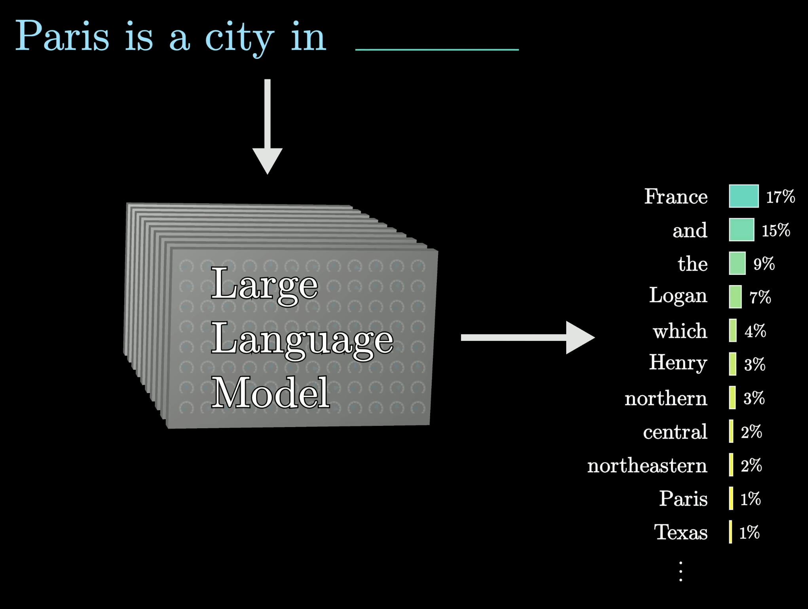{fig-align="left" width="70%"}

::: {.source-credit-linked}
Source: [3Blue1Brown — Large Language Models Explained Briefly](https://www.3blue1brown.com/lessons/mini-llm)
:::

# Part 1: How a Chatbot Works {background-color="#1e3a5f" style="color:white;"}

---

## Step 1: The setup — a system prompt

Before your question, the model receives a description of its role.

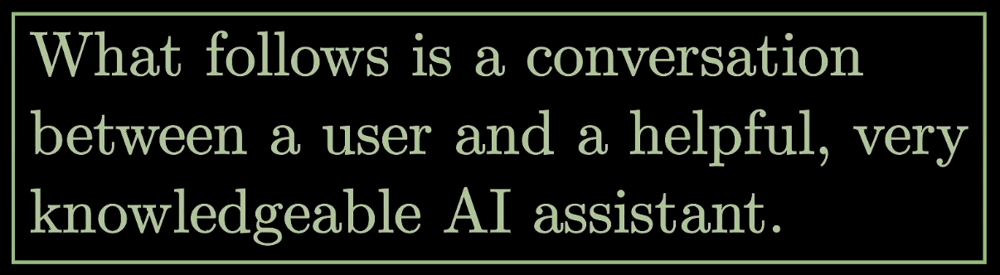{fig-align="left" width="75%"}

::: {.source-credit-linked}
Source: [3Blue1Brown — Large Language Models Explained Briefly](https://www.3blue1brown.com/lessons/mini-llm)
:::

---

## Step 2: The incomplete script

Your question is appended. The AI's response is missing — the model must fill it in.

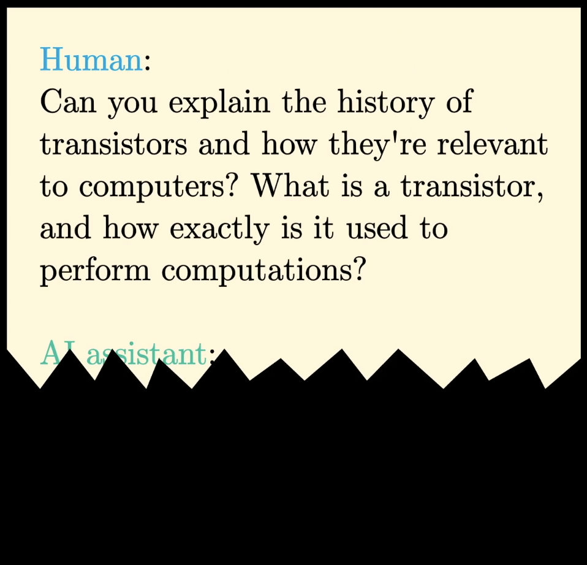{fig-align="left" width="45%"}

::: {.source-credit-linked}
Source: [3Blue1Brown — Large Language Models Explained Briefly](https://www.3blue1brown.com/lessons/mini-llm)
:::

---

## Step 3: Predict one word

The whole text so far is fed into the model. It predicts the most likely next word — here, **"used"**.

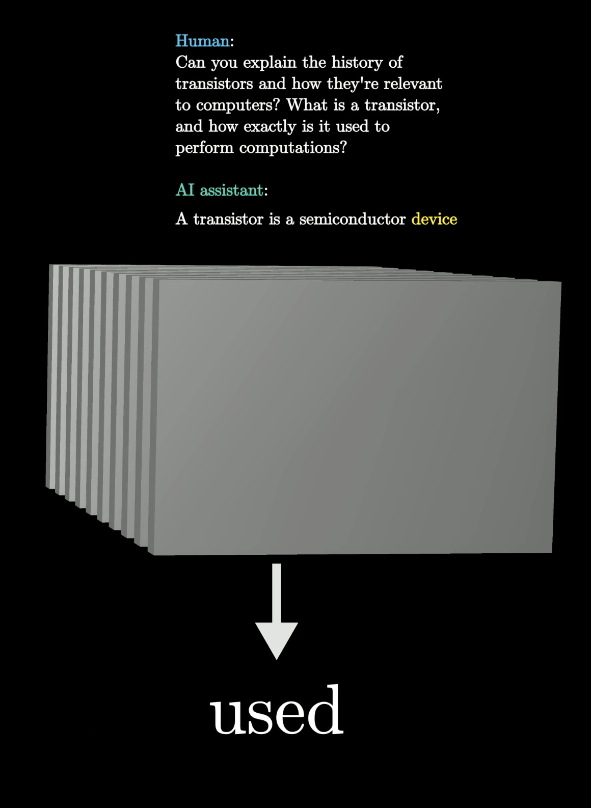{fig-align="left" width="40%"}

::: {.source-credit-linked}
Source: [3Blue1Brown — Large Language Models Explained Briefly](https://www.3blue1brown.com/lessons/mini-llm)
:::

---

## Step 4: Append and repeat

"used" is appended to the script. Feed it all back in. The model now predicts **"to"**. Repeat.

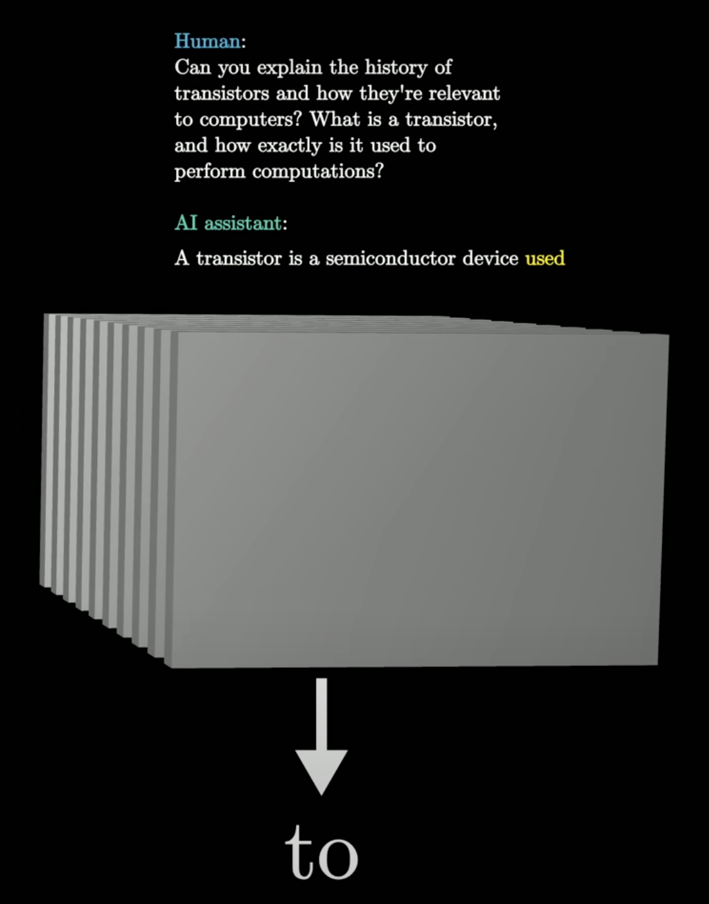{fig-align="left" width="40%"}

::: {.source-credit-linked}
Source: [3Blue1Brown — Large Language Models Explained Briefly](https://www.3blue1brown.com/lessons/mini-llm)
:::

---

## The full chatbot loop

The model is just completing the script — word by word — until the assistant's turn is done.

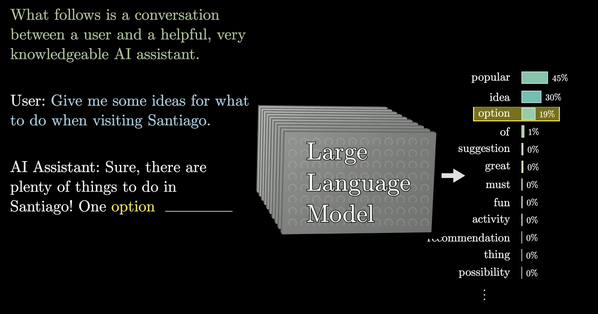{fig-align="left" width="80%"}

::: {.source-credit-linked}
Source: [3Blue1Brown — Large Language Models Explained Briefly](https://www.3blue1brown.com/lessons/mini-llm)
:::

---

## Same prompt → different response

The model doesn't always pick the most likely word. Intentional randomness makes outputs feel natural — and means identical prompts yield different responses.

# Part 2: Training {background-color="#1e3a5f" style="color:white;"}

---

## What is the model trained on?

Vast amounts of internet text. Reading GPT-3's training data would take **over 2,600 years** of non-stop reading.

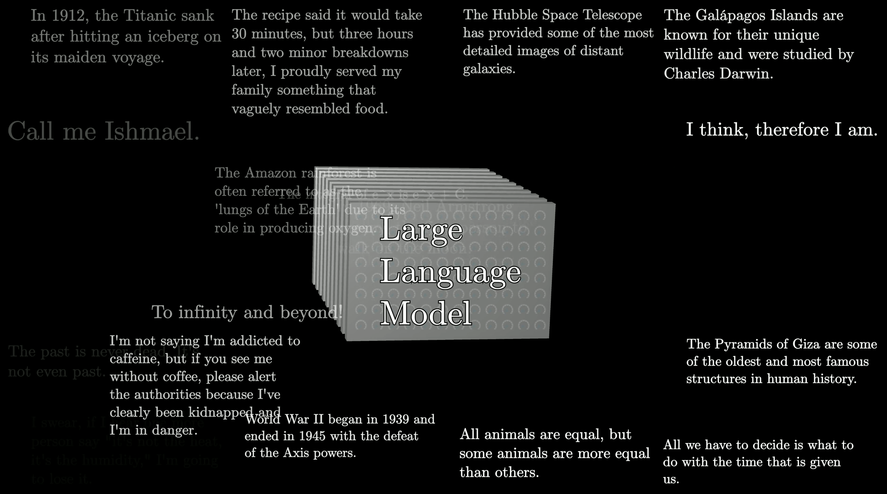{fig-align="left" width="75%"}

::: {.source-credit-linked}
Source: [3Blue1Brown — Large Language Models Explained Briefly](https://www.3blue1brown.com/lessons/mini-llm)
:::

---

## What is a "parameter"?

The model is a function with **hundreds of billions** of tunable dials — parameters. They start at random values and are adjusted through training.

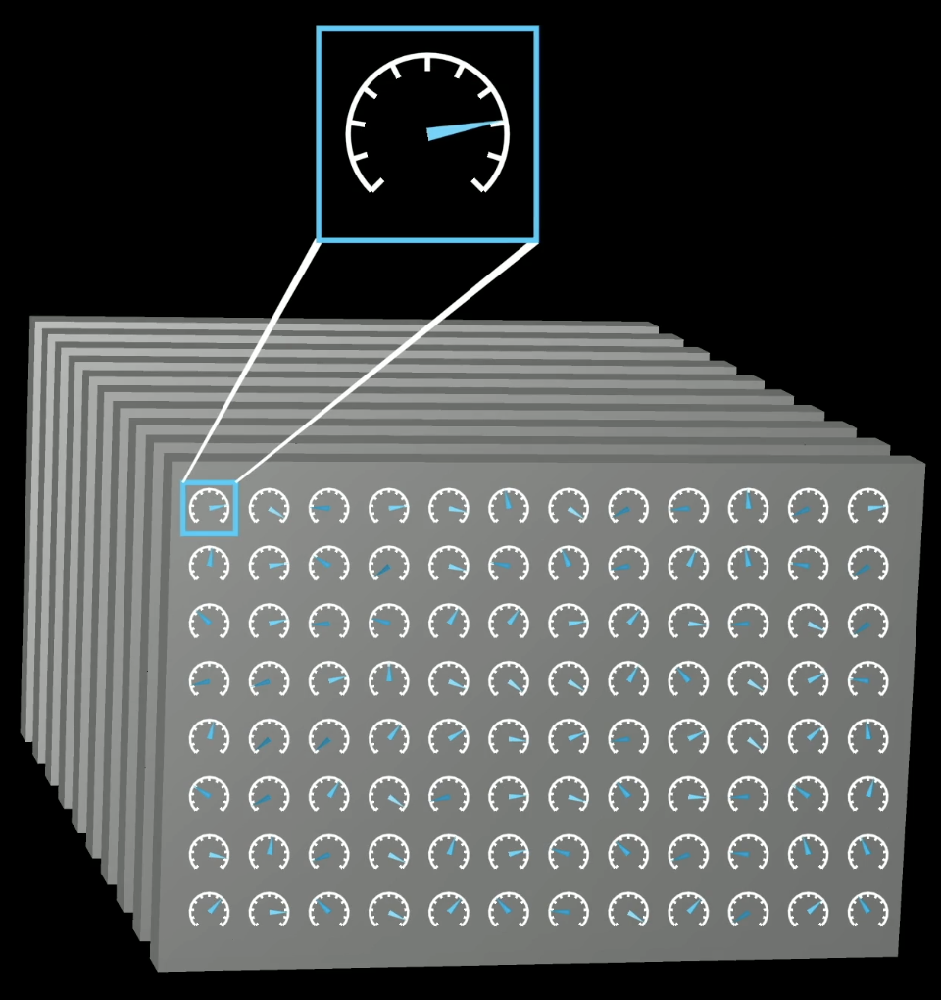{fig-align="left" width="42%"}

::: {.source-credit-linked}
Source: [3Blue1Brown — Large Language Models Explained Briefly](https://www.3blue1brown.com/lessons/mini-llm)
:::

---

## Billions of parameters

Each dial is a continuous number. Their collective setting determines everything the model knows.

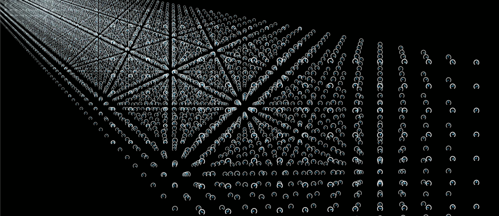{fig-align="left" width="80%"}

::: {.source-credit-linked}
Source: [3Blue1Brown — Large Language Models Explained Briefly](https://www.3blue1brown.com/lessons/mini-llm)
:::

---

## The training objective

Show the model text with the last word hidden. Ask it to predict. Compare against the truth.

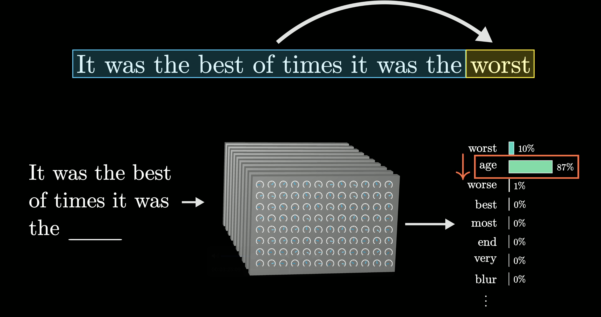{fig-align="left" width="80%"}

Here: model guesses "age" (87%) when the correct answer is "worst" (10%). It's wrong.

::: {.source-credit-linked}
Source: [3Blue1Brown — Large Language Models Explained Briefly](https://www.3blue1brown.com/lessons/mini-llm)
:::

---

## Backpropagation fixes that

Adjust the parameters so "worst" becomes more likely. Do this across **trillions of examples**.

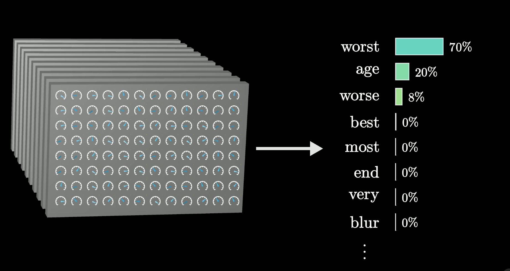{fig-align="left" width="75%"}

After training: "worst" jumps to 70%.

::: {.source-credit-linked}
Source: [3Blue1Brown — Large Language Models Explained Briefly](https://www.3blue1brown.com/lessons/mini-llm)
:::

---

## Two phases of training

Training is not one step — it has two distinct phases.

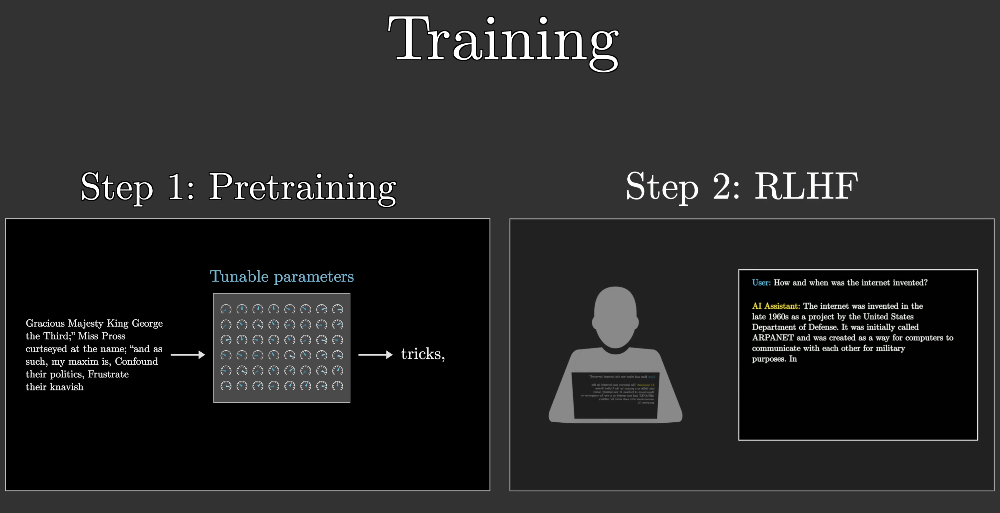{fig-align="left" width="80%"}

**Step 1 — Pre-training:** predict next words on raw text → learns language
**Step 2 — RLHF:** human feedback shapes it into a useful assistant

::: {.source-credit-linked}
Source: [3Blue1Brown — Large Language Models Explained Briefly](https://www.3blue1brown.com/lessons/mini-llm)
:::

---

## RLHF: Reinforcement Learning from Human Feedback

Human workers review model outputs and flag problematic or unhelpful responses. Those corrections adjust the parameters further.

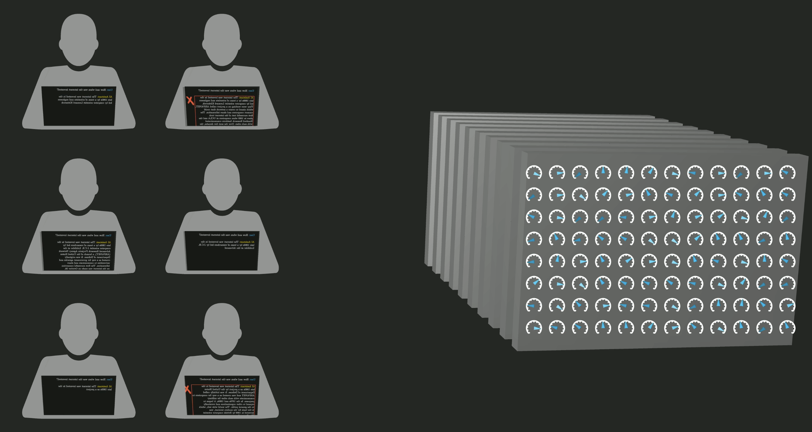{fig-align="left" width="70%"}

This is what turns a raw language model into a chatbot.

::: {.source-credit-linked}
Source: [3Blue1Brown — Large Language Models Explained Briefly](https://www.3blue1brown.com/lessons/mini-llm)
:::

# Part 3: The Transformer Architecture {background-color="#1e3a5f" style="color:white;"}

---

## Why GPUs?

Training requires billions of parallel multiply-and-add operations. GPUs — originally designed for graphics — are built for exactly this.

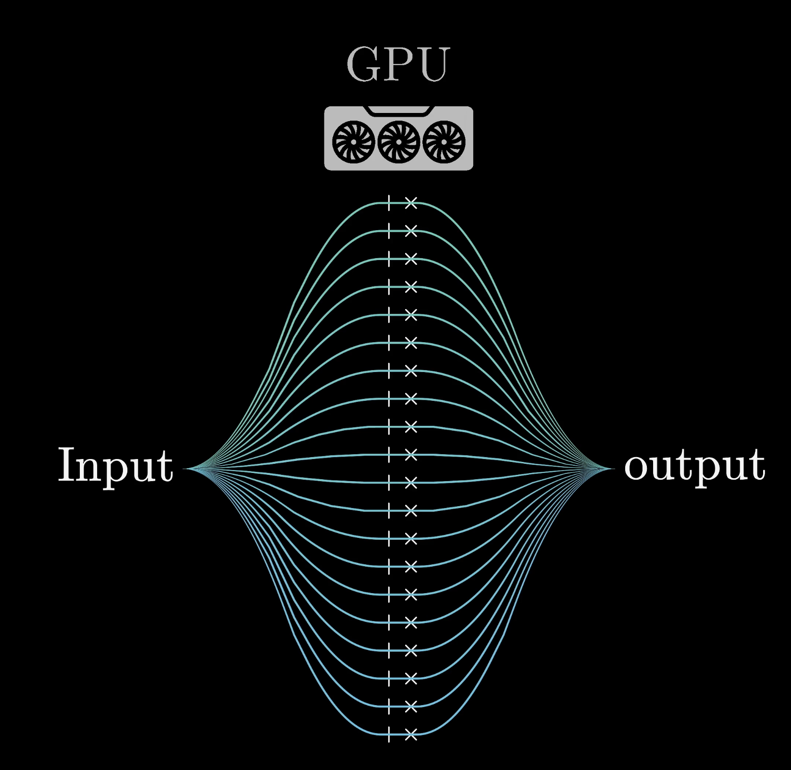{fig-align="left" width="50%"}

::: {.source-credit-linked}
Source: [3Blue1Brown — Large Language Models Explained Briefly](https://www.3blue1brown.com/lessons/mini-llm)
:::

---

## The 2017 breakthrough: Transformers

Before 2017, models processed text **one word at a time** (sequential). Transformers process the **whole sequence at once** (parallel).

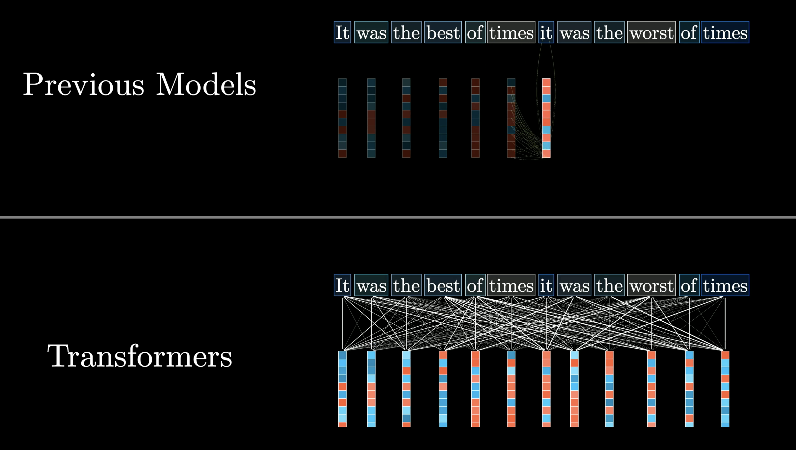{fig-align="left" width="80%"}

::: {.source-credit-linked}
Source: [3Blue1Brown — Large Language Models Explained Briefly](https://www.3blue1brown.com/lessons/mini-llm)
:::

---

## Words → vectors

Each word is mapped to **a long list of numbers** — a vector. These numbers encode the word's meaning in a form the model can compute with.

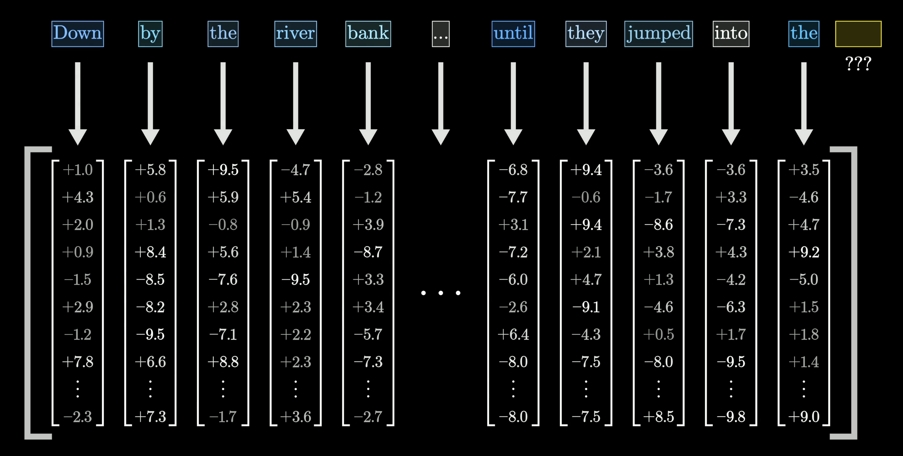{fig-align="left" width="85%"}

::: {.source-credit-linked}
Source: [3Blue1Brown — Large Language Models Explained Briefly](https://www.3blue1brown.com/lessons/mini-llm)
:::

---

## Attention: vectors that communicate

The **attention** operation lets every vector update itself based on context from other vectors.

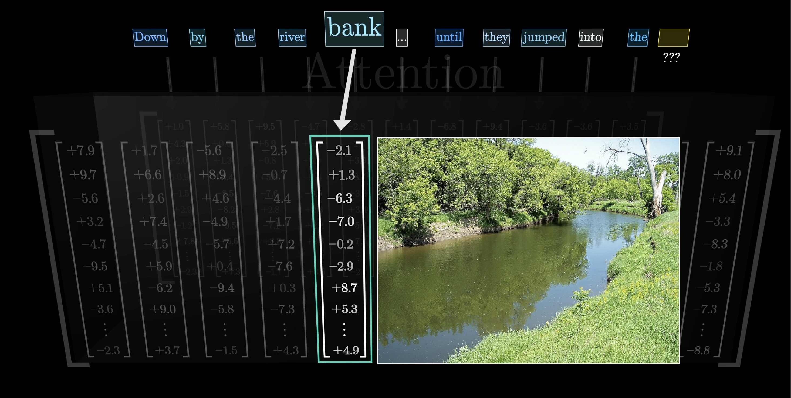{fig-align="left" width="80%"}

*"bank"* surrounded by *"river"* and *"jumped into"* → the vector shifts to encode **riverbank**, not financial institution.

::: {.source-credit-linked}
Source: [3Blue1Brown — Large Language Models Explained Briefly](https://www.3blue1brown.com/lessons/mini-llm)
:::

---

## Over and over: layers refine meaning

Attention and feed-forward layers alternate, repeatedly. Each pass enriches the vectors.

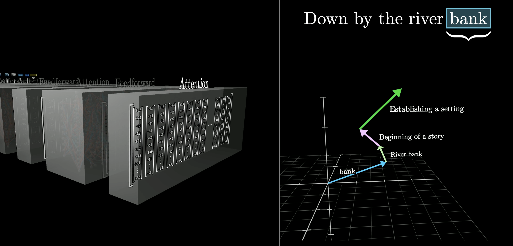{fig-align="left" width="85%"}

Right: the "bank" vector travels through meaning-space — from the raw token, to riverbank, to narrative context.

::: {.source-credit-linked}
Source: [3Blue1Brown — Large Language Models Explained Briefly](https://www.3blue1brown.com/lessons/mini-llm)
:::

---

## The final prediction

After all layers, the last vector encodes everything: context + training knowledge. A final function converts it to a probability distribution.

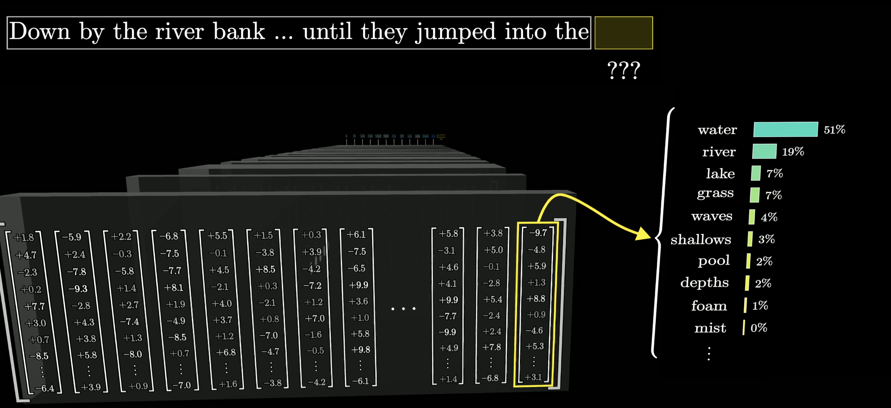{fig-align="left" width="85%"}

*"Down by the river bank … until they jumped into the ___"* → water: 51%, river: 19%, lake: 7% …

::: {.source-credit-linked}
Source: [3Blue1Brown — Large Language Models Explained Briefly](https://www.3blue1brown.com/lessons/mini-llm)
:::

# Part 4: Why This Matters for Genomics {background-color="#1e3a5f" style="color:white;"}

---

## DNA as a language

The exact same framework applies to genomic sequences:

| Language LLM | Genomic LM |
|---|---|
| Words / tokens | Nucleotides, k-mers |
| Next-word prediction | Next-nucleotide prediction |
| Pre-train on internet text | Pre-train on reference genome |
| Fine-tune for task | Fine-tune for TF binding, promoter activity |

---

## What we'll build in this unit

1. **slides-01** — Tokens, embeddings, dot products, softmax — the geometric foundations
2. **slides-02** — Transformers in detail: attention, Q/K/V, multi-head, residuals
3. **slides-03** — Training a language model: tokenization, loss, the training loop, generation
4. **notebook-01** — Build nanoGPT from scratch on Tiny Shakespeare (Karpathy)
5. **notebook-02** — DNA language model: pretrain on the human genome, fine-tune for prediction

---

## Key Takeaways

- An LLM outputs a **probability distribution** over the next word — not one answer
- Chatbots work by **autoregressive generation**: predict → append → repeat
- Parameters begin **random**; backprop over trillions of examples shapes them
- **Pre-training** on text + **RLHF** from human feedback = a useful assistant
- The **Transformer** (2017) processes the whole sequence in parallel via attention
- Words become **vectors**; attention lets those vectors update each other from context
- Behavior **emerges** from training — nobody programmed what the model knows
