## Where we are

- **slides-00** — LLMs from the outside: chatbot loop, training, attention in one sentence
- **This deck** — inside the transformer: how text becomes numbers, what those numbers mean, and how probabilities emerge
- **slides-02** — attention mechanism and full architecture in code

::: {.source-credit-linked}
Source: [3Blue1Brown — What is a GPT? Visual intro to transformers](https://www.3blue1brown.com/lessons/gpt)
:::

# Part 1: Tokens {background-color="#1e3a5f" style="color:white;"}

---

## Text breaks into chunks: tokens

Before any math, text is split into **tokens** — the atomic units the model works with.

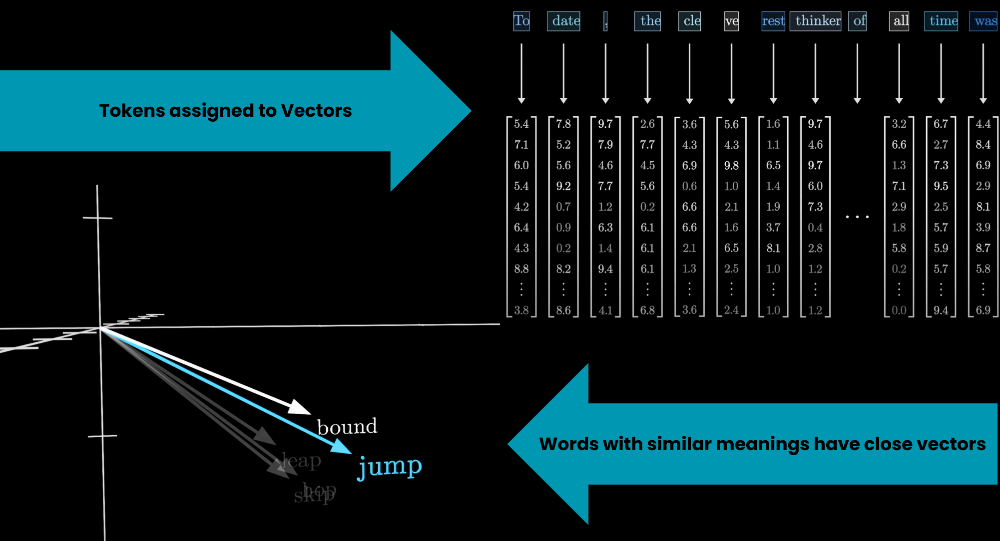{fig-align="left" width="85%"}

::: {.source-credit-linked}
Source: [3Blue1Brown — What is a GPT?](https://www.3blue1brown.com/lessons/gpt)
:::

---

## Tokens become arrays of numbers

Each token maps to a **vector** — a list of numbers. This is what the model actually computes with.

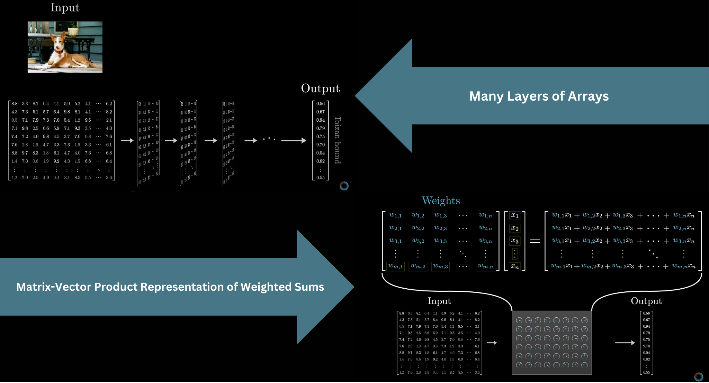{fig-align="left" width="80%"}

The numbers start as a lookup (same token = same vector). Context changes them later.

::: {.source-credit-linked}
Source: [3Blue1Brown — What is a GPT?](https://www.3blue1brown.com/lessons/gpt)
:::

---

## The embedding matrix W_E

The first thing a transformer does: look up each token in the **embedding matrix W_E**.

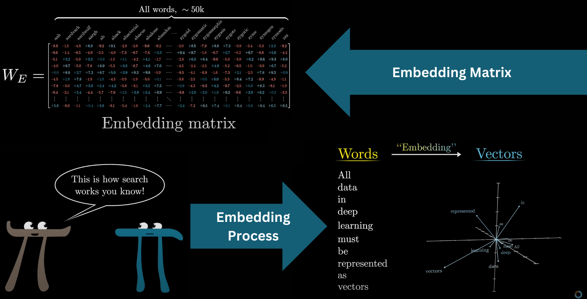{fig-align="left" width="80%"}

GPT-3: vocabulary = 50,257 tokens × 12,288 dimensions → **617 million weights** just in this one matrix.

::: {.source-credit-linked}
Source: [3Blue1Brown — What is a GPT?](https://www.3blue1brown.com/lessons/gpt)
:::

# Part 2: Semantic Geometry {background-color="#1e3a5f" style="color:white;"}

---

## Similar meanings cluster in space

Word vectors are not random. Words with similar meanings end up **close together** in the high-dimensional space.

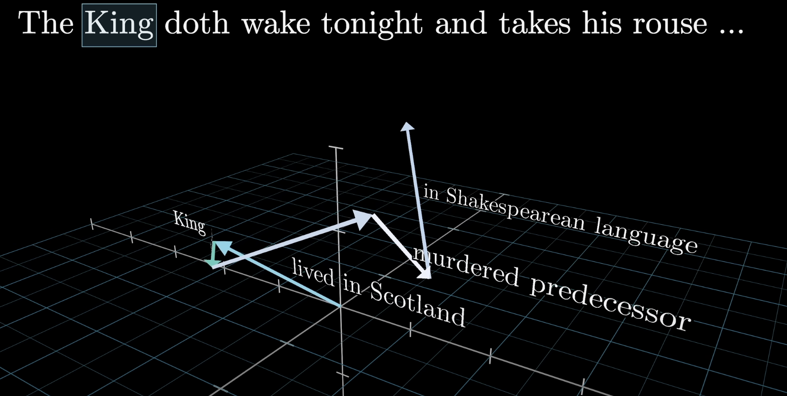{fig-align="left" width="75%"}

::: {.source-credit-linked}
Source: [3Blue1Brown — What is a GPT?](https://www.3blue1brown.com/lessons/gpt)
:::

---

## Directions encode meaning

The **difference** between "man" and "woman" vectors is similar to the difference between "king" and "queen."

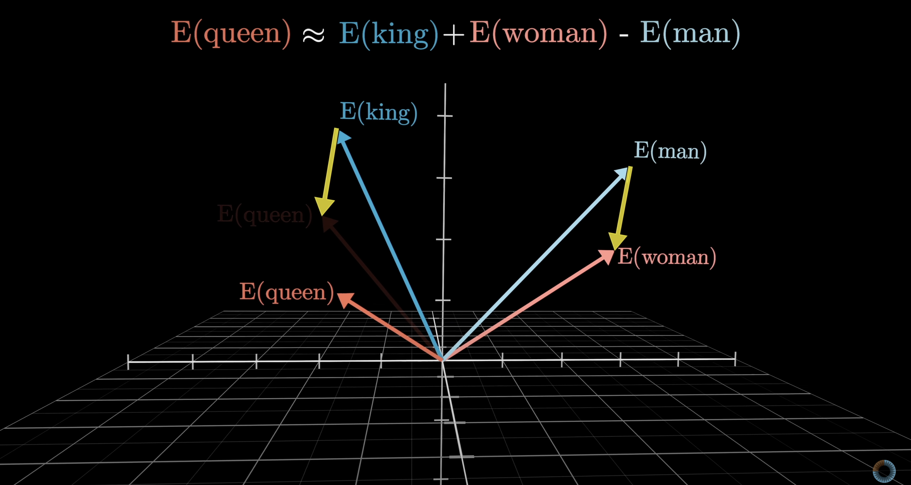{fig-align="left" width="75%"}

There is a **gender direction** in embedding space — not programmed in, learned from text.

::: {.source-credit-linked}
Source: [3Blue1Brown — What is a GPT?](https://www.3blue1brown.com/lessons/gpt)
:::

---

## Semantic directions are consistent

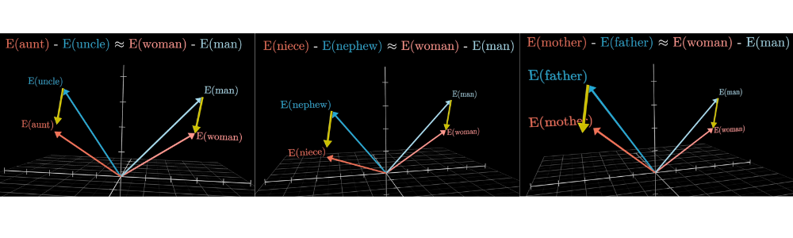{fig-align="left" width="80%"}

The same direction that encodes gender also generalizes across many word pairs — it's a stable geometric feature of the space.

::: {.source-credit-linked}
Source: [3Blue1Brown — What is a GPT?](https://www.3blue1brown.com/lessons/gpt)
:::

---

## Geography works too

The difference between country and capital vectors is consistent across examples.

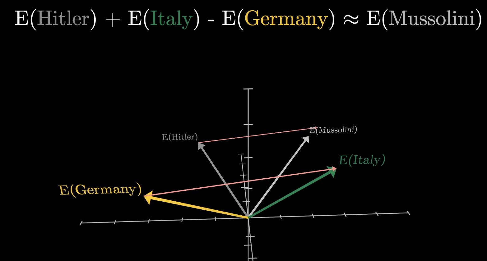{fig-align="left" width="75%"}

Subtracting "Germany" from "Italy" and adding to "Hitler" lands near "Mussolini." Meaning lives in geometry.

::: {.source-credit-linked}
Source: [3Blue1Brown — What is a GPT?](https://www.3blue1brown.com/lessons/gpt)
:::

# Part 3: Dot Products & Similarity {background-color="#1e3a5f" style="color:white;"}

---

## Dot product = measure of alignment

The **dot product** is how the model asks: *how similar are these two vectors?*

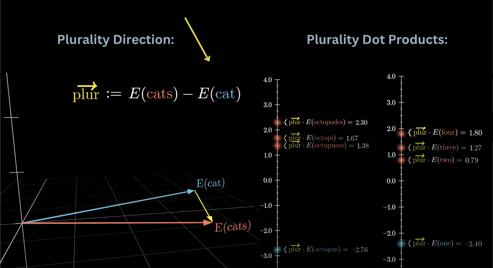{fig-align="left" width="75%"}

- Positive → vectors point in the same direction (similar)
- Zero → perpendicular (unrelated)
- Negative → opposite directions (different)

::: {.source-credit-linked}
Source: [3Blue1Brown — What is a GPT?](https://www.3blue1brown.com/lessons/gpt)
:::

---

## How to compute it

Multiply corresponding components, then sum.

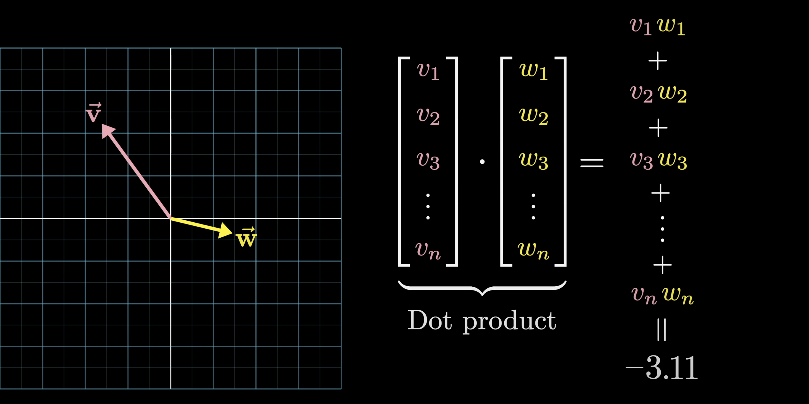{fig-align="left" width="75%"}

This simple operation is **the core computation** inside attention, inside every linear layer — it appears thousands of times per forward pass.

::: {.source-credit-linked}
Source: [3Blue1Brown — What is a GPT?](https://www.3blue1brown.com/lessons/gpt)
:::

---

## Context window: what the model sees

The model processes a fixed window of tokens at once.

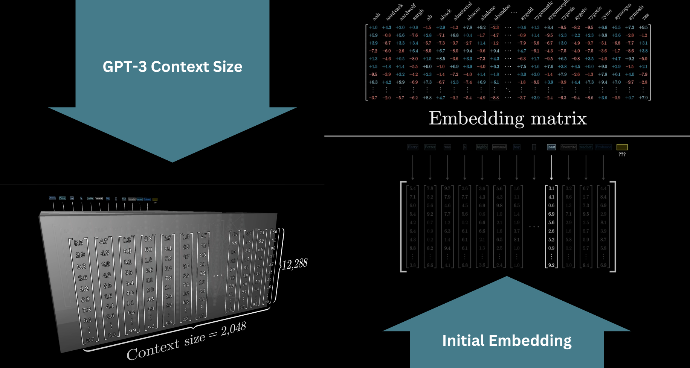{fig-align="left" width="80%"}

GPT-3 context = 2,048 tokens. Modern models extend this to 100k+. Everything outside the window is invisible to the model.

::: {.source-credit-linked}
Source: [3Blue1Brown — What is a GPT?](https://www.3blue1brown.com/lessons/gpt)
:::

---

## Same word, different meaning

Initial vectors encode the word alone. As vectors flow through the network, they absorb context.

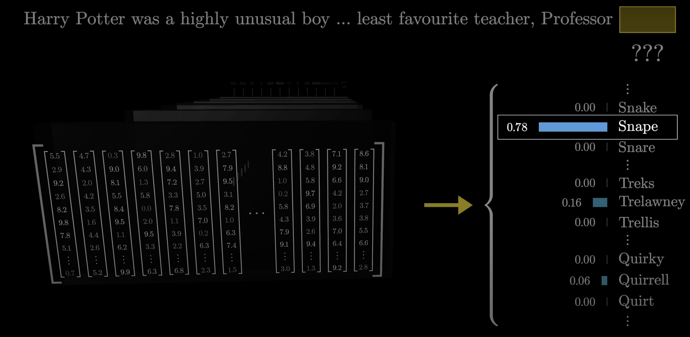{fig-align="left" width="75%"}

*"Snape"* in a sentence about potions → different final vector than *"Snape"* in a sentence about betrayal. Same starting point, different destination.

::: {.source-credit-linked}
Source: [3Blue1Brown — What is a GPT?](https://www.3blue1brown.com/lessons/gpt)
:::

# Part 4: Softmax & Unembedding {background-color="#1e3a5f" style="color:white;"}

---

## Getting back to words: W_U

After all transformer layers, the final vector must become a **probability distribution** over the vocabulary.

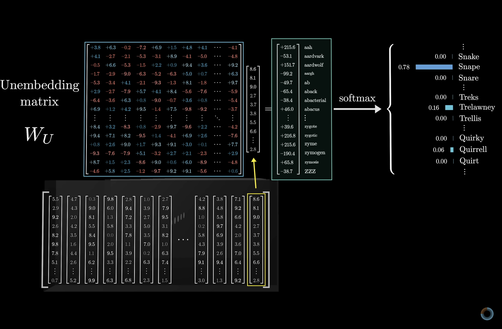{fig-align="left" width="80%"}

The **unembedding matrix W_U** maps the final vector back to one score per vocabulary token. Same dimensions as W_E, transposed.

::: {.source-credit-linked}
Source: [3Blue1Brown — What is a GPT?](https://www.3blue1brown.com/lessons/gpt)
:::

---

## Softmax: from scores to probabilities

Raw scores (logits) can be any number. **Softmax** converts them into a valid probability distribution.

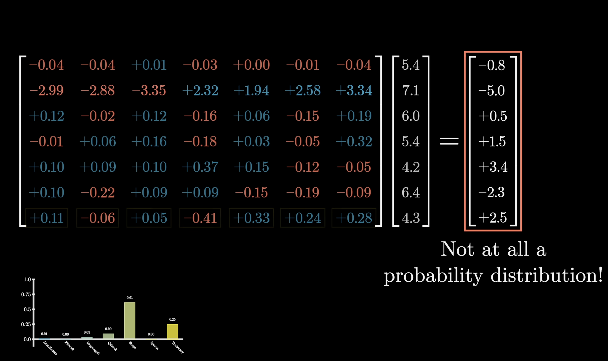{fig-align="left" width="75%"}

1. Raise $e$ to each score's power (forces positive)
2. Sum all values
3. Divide each by the sum

::: {.source-credit-linked}
Source: [3Blue1Brown — What is a GPT?](https://www.3blue1brown.com/lessons/gpt)
:::

---

## How softmax behaves

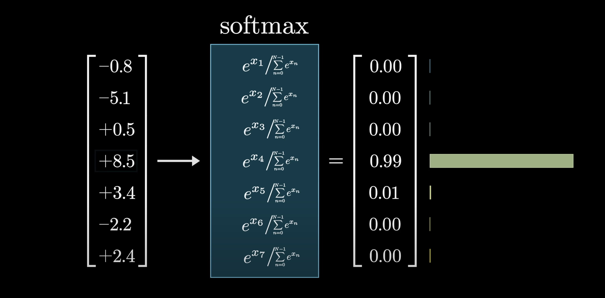{fig-align="left" width="80%"}

Large differences between scores → one token dominates. Small differences → distribution spreads out.

::: {.source-credit-linked}
Source: [3Blue1Brown — What is a GPT?](https://www.3blue1brown.com/lessons/gpt)
:::

---

## Temperature: dialing confidence up or down

Divide logits by temperature $T$ before softmax:

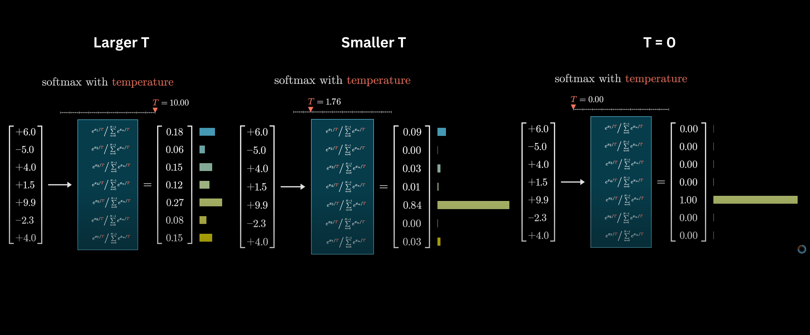{fig-align="left" width="80%"}

| Temperature | Effect |
|------------|--------|
| $T < 1$ | Sharper — model is more decisive |
| $T = 1$ | Default |
| $T > 1$ | Flatter — more random, more creative |
| $T \to 0$ | Always picks the top token (greedy) |

::: {.source-credit-linked}
Source: [3Blue1Brown — What is a GPT?](https://www.3blue1brown.com/lessons/gpt)
:::

---

## The full prediction pipeline

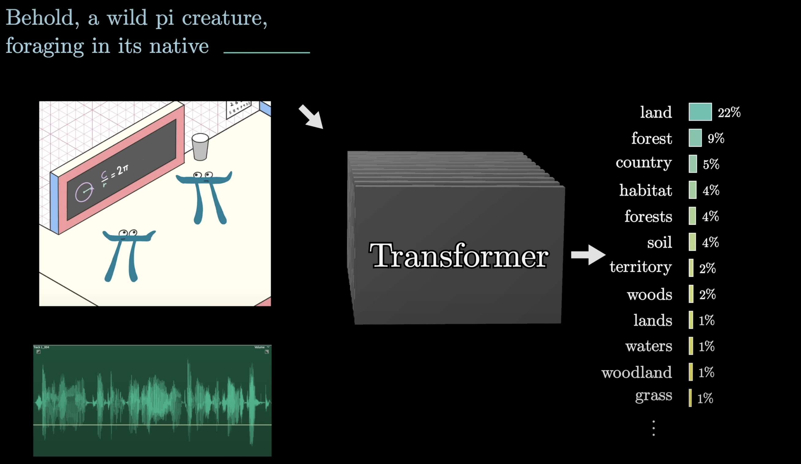{fig-align="left" width="85%"}

Token → W_E → transformer layers → W_U → softmax → sample next token.

::: {.source-credit-linked}
Source: [3Blue1Brown — What is a GPT?](https://www.3blue1brown.com/lessons/gpt)
:::

# Part 5: Preview — Attention {background-color="#1e3a5f" style="color:white;"}

---

## What attention does

We have vectors. We have dot products. Attention uses both: each token's vector **queries** other tokens' **keys** to decide how much to attend.

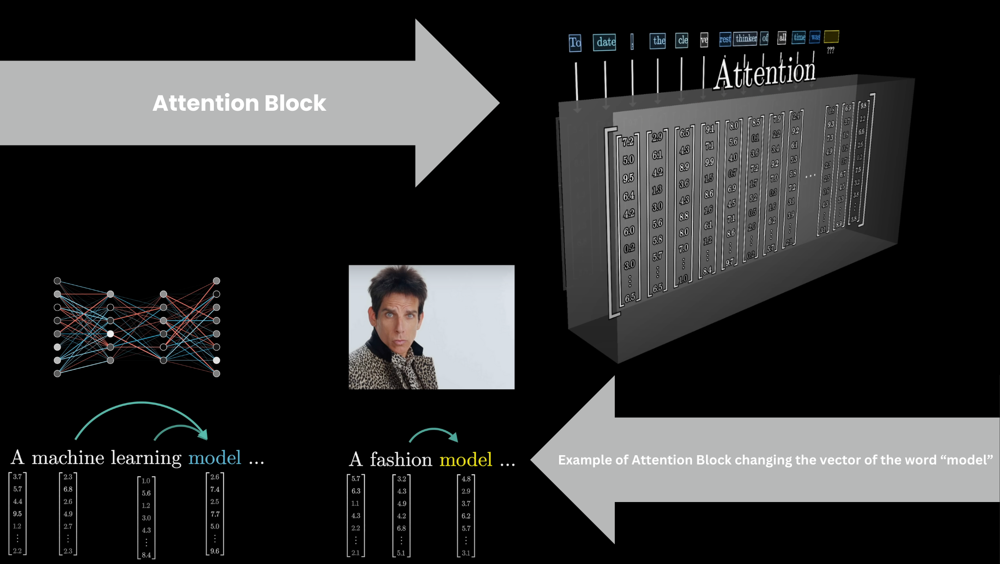{fig-align="left" width="80%"}

The result: vectors update each other based on relevance. *"bank"* near *"river"* shifts toward riverbank. This is the mechanism that makes transformers powerful.

::: {.source-credit-linked}
Source: [3Blue1Brown — What is a GPT?](https://www.3blue1brown.com/lessons/gpt)
:::

---

## Multiple heads, multiple relationships

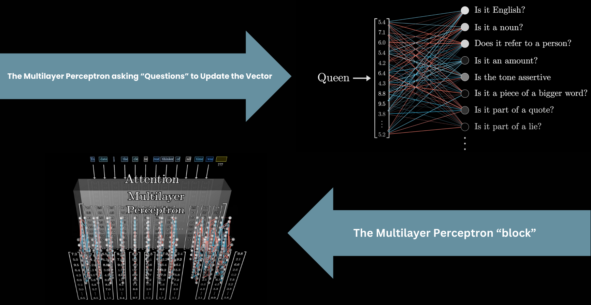{fig-align="left" width="80%"}

Running many attention heads in parallel lets the model track different types of relationships simultaneously — syntactic, semantic, positional.

Next deck: the full Q/K/V math and how this works in code.

::: {.source-credit-linked}
Source: [3Blue1Brown — What is a GPT?](https://www.3blue1brown.com/lessons/gpt)
:::

---

## Key Takeaways

- Text → tokens → integer IDs → vectors via **W_E** (the embedding matrix)
- Embedding space has **geometric structure**: similar meanings cluster, directions encode properties
- **Dot products** measure vector similarity — the fundamental operation throughout
- Initial vectors encode the word alone; transformer layers give them **context**
- **W_U** maps the final vector back to vocabulary scores; **softmax** converts to probabilities
- **Temperature** controls how peaked or flat the output distribution is
- Everything is matrix multiplication — attention next
