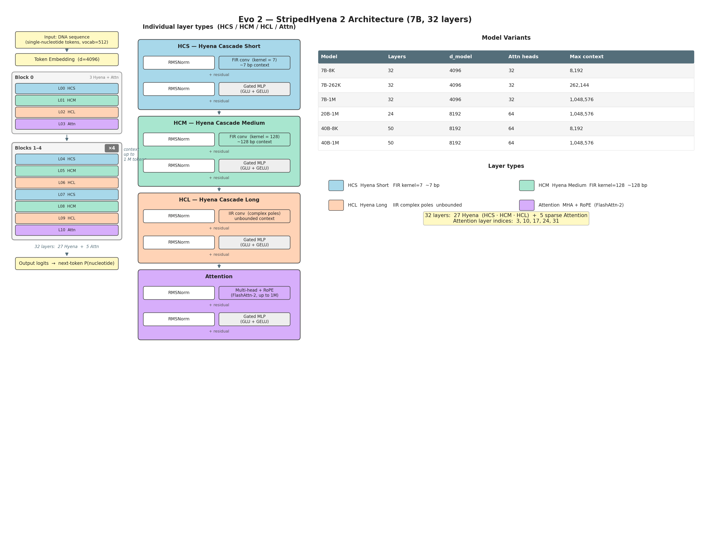
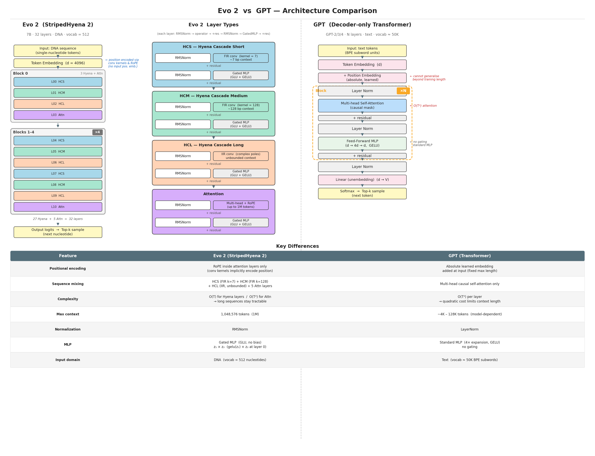

## Where we are

- **notebook-01** — built nanoGPT from scratch; understood tokens, embeddings, attention, training
- **notebook-02** — trained a tiny GPT on DNA; finetuned to classify promoters and enhancers
- **This deck** — Evo2 scales that exact idea to the whole tree of life

# Part 1: What Scaling Gets You {background-color="#1e3a5f" style="color:white;"}

## Our nanoGPT on DNA — what it could do

:::: {.columns}

::: {.column width="50%"}
**What worked**

- Learned nucleotide statistics
- Generated plausible-looking sequences
- Classified promoters (with fine-tuning)
- Classified enhancers (with fine-tuning)
:::

::: {.column width="50%"}
**What it couldn't do**

- Predict whether a mutation is harmful
- Handle sequences longer than a few thousand bases
- Generalize across species
:::

::::

---

## Scaling the same idea

::: {style="font-size: 0.85em;"}
| | nanoGPT on DNA | Evo 2 |
|---|---|---|
| **Parameters** | ~7M | 7B – 40B |
| **Training data** | 3B nucleotides | 9.3T nucleotides |
| **Context length** | ~1K tokens | up to 1M bases |
| **Organisms** | human | bacteria, archaea, yeast, humans, phage |
| **Architecture** | Transformer | StripedHyena 2 |

Same core idea — next-token prediction on DNA — just much larger and across all domains of life.
:::

# Part 2: Why Not Just a Bigger Transformer? {background-color="#1e3a5f" style="color:white;"}

## The attention bottleneck

Transformer attention is **O(n²)** in sequence length.

| Context length | Quadratic cost | Practical? |
|---|---|---|
| 1K tokens | 1× | ✅ (our nanoGPT) |
| 8K tokens | 64× | ✅ (GPT-4) |
| 128K tokens | 16,384× | ⚠️ (needs FlashAttention) |
| **1M bases** | **10⁶×** | ❌ transformer alone |

To model gene regulation (enhancers hundreds of kb from their target genes), you need 1M+ context. A pure transformer is too costly.

---

## DNA function operates at many scales simultaneously

| Scale | Feature |
|---|---|
| **~3 bp** | Codon boundaries |
| **~20 bp** | Transcription factor binding motifs |
| **~100 bp** | Promoters, splice sites |
| **~1–100 kb** | Enhancer–promoter loops |
| **~1 Mb** | Chromosomal domains |

A model that only sees local context (short window) or only global context (expensive attention) misses part of the picture.

---

## StripedHyena 2: mixing scales

{fig-align="center" width="85%"}

::: {.source-credit}
Arc Institute / Evo 2 (2026)
:::

---

## What the stripes mean

Most layers are **fast convolutions** (O(n log n)); attention appears rarely for global mixing.

| Layer type | Scale | Cost |
|---|---|---|
| **HCS** — Hyena Cascade Short | ~7 bp | O(n log n) |
| **HCM** — Hyena Cascade Medium | ~128 bp | O(n log n) |
| **HCL** — Hyena Cascade Long | unbounded | O(n log n) via IIR |
| **Attention** (5 of 32 layers) | global | O(n²), sparse |

Result: **up to 3× faster** than a full Transformer at 1M context — making genome-scale training feasible.

---

## Evo 2 vs. a standard GPT

{fig-align="center" width="90%"}

::: {.source-credit}
Arc Institute / Evo 2 (2026)
:::

# Part 3: Three Things Evo 2 Can Do That nanoGPT Couldn't {background-color="#1e3a5f" style="color:white;"}

## 1. Zero-shot variant effect prediction

Evo 2 assigns a **likelihood** to every DNA sequence — a lower score for a mutant means the model predicts disrupted function. **No fine-tuning. No labeled examples.**

On the BRCA1 gene (experimentally measured variants):

- Zero-shot: outperforms all models on noncoding SNVs
- Embeddings + ridge regression → AUROC = 0.95
- Works on **indels** too — not just SNPs

::: {.takehome}
Most clinical variants are rare and unlabeled — Evo 2 can prioritize them immediately, zero-shot.
:::

:::{.notes}
For each position in the sequence, it calculates the probability of the actual token given all   
 the tokens before it, then averages those probabilities (log-probabilities) across the whole sequence.20
:::
---

## 2. Generate genomes at scale

Prompt Evo 2 with the first 10 kb of *Mycoplasma genitalium*; it completes the full 580 kb genome.

| | Natural | Evo 2 generated | Evo 1 (baseline) |
|---|---|---|---|
| **% genes with Pfam hits** | ~90% | ~70% | 18% |
| **Protein length distribution** | ✓ | ✓ | ✗ |
| **Structural folds** | ✓ | ✓ | partial |

Same result for yeast: 330 kb chromosomes with tRNAs, promoters, and intron structure intact.

---

## 3. Design regulatory elements

Evo 2 acts as a **proposal model**: it generates candidate sequences; external models (Enformer, Borzoi) score their chromatin accessibility; beam search keeps the best.

**Morse code chromatin experiment:**
- Encoded "EVO2", "ARC", "LO" as dot/dash accessibility patterns in DNA
- Synthesized and integrated into mouse embryonic stem cells
- Measured accessibility by ATAC-seq → AUROC 0.92–0.95

::: {.takehome}
Evo 2 can generate DNA sequences with **programmable regulatory activity** — validated in living cells.
:::

# Part 4: What Did It Learn? {background-color="#1e3a5f" style="color:white;"}

## Interpretability: Sparse Autoencoders

::: {style="font-size: 0.85em;"}
Trained a **Sparse Autoencoder (SAE)** on layer 26 activations — no labels, no supervision.

| SAE Feature | What it activates on |
|---|---|
| f/19746 | Prophage regions in *E. coli* |
| f/1050 | First base of exon (splice start) |
| f/25666 | Last base of exon (splice end) |
| f/15680 | Coding regions (bacteria too) |
| various | TF binding motifs, α-helices, β-sheets |
:::

::: {.takehome}
The model learned **gene structure, regulatory elements, and protein properties** from sequence alone — no annotation used.
:::

---

## Key takeaways

1. **Same training objective, different scale** — next-token prediction on DNA, but 9.3T nucleotides across all life

2. **Architecture changes to handle large context** — StripedHyena 2 replaces most attention with fast convolutions to reach 1M-token context

3. **Zero-shot** — likelihood scores predict variant pathogenicity without any task-specific training

4. **Generation + guidance = design** — Evo 2 can be steered to produce DNA with programmable function

5. **Fully open** — weights, code, training data (OpenGenome2) all public

---

## Resources

- **Paper**: "Genome modelling and design across all domains of life with Evo 2" — *Nature* 2026
- **Code + weights**: github.com/ArcInstitute/evo2 · huggingface.co/arcinstitute
- **Dataset**: OpenGenome2 (huggingface.co/datasets/arcinstitute/opengenome2)
- **Interactive**: arcinstitute.org/tools/evo/

::: {.source-credit}
Arc Institute / Evo 2 (2026)
:::
