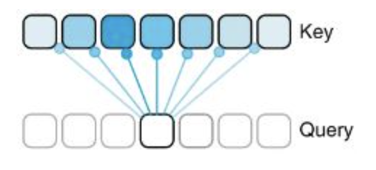
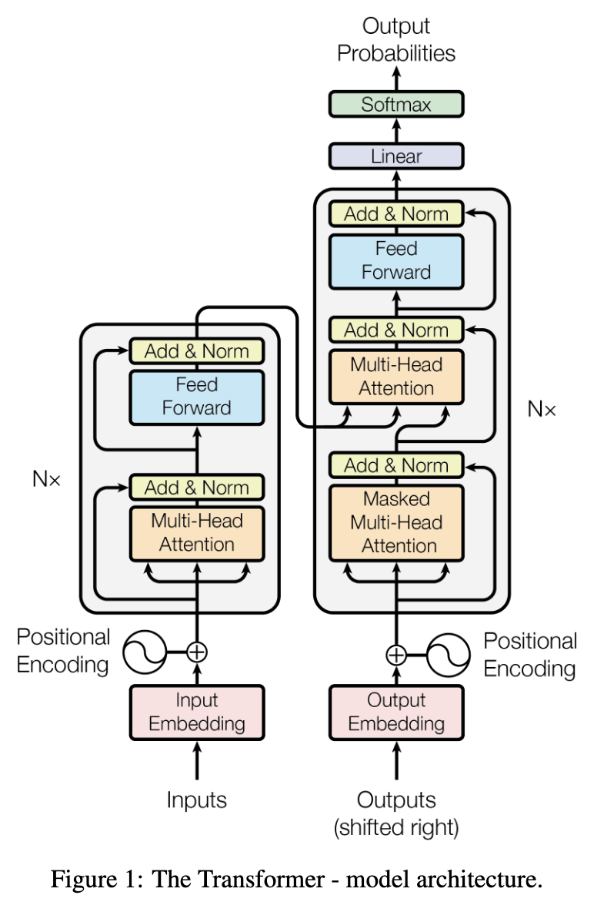

## Unit 01 Roadmap

| Unit | Question | Topic |
|--|------|---|
| 0 | Can we detect regulatory motifs in DNA? | MLP, CNN |
| **1** | **Can we learn the "language" of DNA?** | **Transformers & Genomic GPT** |
| 2 | Can we predict gene regulation from sequence? | Enformer & Borzoi |
| 3 | Can we model microbial communities? | — |

---

## What we're building toward

By the end of this unit you will:

1. Understand how the **Transformer** architecture works — attention, Q/K/V, multi-head, residuals
2. Know how to **train** a language model from scratch (tokenization → loss → generation)
3. Have trained a **DNA language model** using nanoGPT and fine-tuned it for prediction

# Part 1: The Language Modeling Task {background-color="#1e3a5f" style="color:white;"}

---

## What is a language model?

- **Core idea:** predict the *next token* given the preceding tokens
- A token can be a character, sub-word, or k-mer
- Examples:
  - Text: given `"To be or not to"`, predict `"be"`
  - DNA: given `ACGTACG`, predict the next nucleotide

::: {.fragment}
**Why does this matter for genomics?**

If a model can predict the next nucleotide well, it has learned something about the *statistical structure of genomes* — regulatory grammars, codon usage, conservation patterns.
:::

---

## Character-level GPT: the setup

- **Dataset:** Tiny Shakespeare (~1M characters, 65 unique chars)
- **Vocabulary:** every unique character → integer
  - `stoi`: `'a'` → 0, `'b'` → 1, …
  - `itos`: reverse mapping
- **Encoding:** entire text becomes a long integer tensor

```python
chars = sorted(list(set(text)))
stoi = { ch: i for i, ch in enumerate(chars) }
encode = lambda s: [stoi[c] for c in s]
data = torch.tensor(encode(text), dtype=torch.long)
```

---

## Batching: context and target

- **`block_size`** (context length): how many tokens the model sees
- Every position in the block is a training example:

```
sequence: [18, 47, 56, 57, 58, 1, 15, 47, 58]

input  x: [18, 47, 56, 57, 58, 1, 15, 47]
target y: [47, 56, 57, 58, 1, 15, 47, 58]
```

When input is `[18]` → target is `47`
When input is `[18, 47]` → target is `56`
…and so on. One sequence = `block_size` training examples.

- **`batch_size`:** run multiple sequences in parallel

---

## Baseline: bigram language model

The simplest model — predict next token from *only the last token*:

```python
class BigramLanguageModel(nn.Module):
    def __init__(self, vocab_size):
        self.token_embedding_table = nn.Embedding(vocab_size, vocab_size)

    def forward(self, idx):
        logits = self.token_embedding_table(idx)  # (B, T, vocab_size)
        return logits
```

- Row `i` of the embedding table = predicted scores for "what comes after token `i`"
- **Limitation:** ignores everything except the last character
- Output is nearly random — we need the model to *look further back*

# Part 2: The Attention Mechanism {background-color="#1e3a5f" style="color:white;"}

---

## The core problem

CNNs can see a local window. How do we let every token see *any* earlier token?

::: {.columns}
::: {.column width="50%"}
**Naive solution:** average all past token embeddings

```python
# version 1: for loop
for b in range(B):
    for t in range(T):
        x_prev = x[b, :t+1]          # (t+1, C)
        xbow[b, t] = x_prev.mean(0)  # (C,)
```
:::
::: {.column width="50%"}
**Problem:** treats all past tokens equally — no notion of relevance
:::
:::

::: {.fragment}
**Self-attention:** let each token *decide* how much to attend to each previous token, based on content
:::

---

## Weighted aggregation via matrix multiply

```python
# version 2: matrix multiply (no loop)
wei = torch.tril(torch.ones(T, T))
wei = wei / wei.sum(1, keepdim=True)   # normalize rows
xbow = wei @ x   # (T, T) @ (B, T, C) -> (B, T, C)
```

- `tril` mask: token at position `t` can only see positions `0..t` (causal / autoregressive)
- Equal weights → uniform average
- Next: make weights *data-dependent*

---

## Self-Attention: Query, Key, Value

For each token, compute three vectors:

| Vector | Meaning |
|--------|---------|
| **Query (Q)** | *What am I looking for?* |
| **Key (K)** | *What do I contain?* |
| **Value (V)** | *What I'll share if attended to* |

**Attention score** between positions `i` and `j`:
$$\text{score}_{ij} = \frac{Q_i \cdot K_j}{\sqrt{d_k}}$$

---

## Self-Attention: the full computation

```python
k = self.key(x)    # (B, T, head_size)
q = self.query(x)  # (B, T, head_size)
v = self.value(x)  # (B, T, head_size)

# attention scores
wei = q @ k.transpose(-2, -1) * head_size**-0.5  # (B, T, T)

# causal mask: can't attend to future tokens
wei = wei.masked_fill(tril == 0, float('-inf'))
wei = F.softmax(wei, dim=-1)   # (B, T, T)

out = wei @ v   # (B, T, head_size)
```

- Scaling by $\sqrt{d_k}$: prevents softmax from saturating when scores are large
- Causal mask: essential for autoregressive generation

---

## Why does causal masking matter?

::: {.columns}
::: {.column width="55%"}
Without masking, token at position `t` could "see" future tokens — the model would cheat during training and couldn't generate autoregressively at test time.

```
         t=0  t=1  t=2  t=3
t=0  [  1    0    0    0  ]
t=1  [  1    1    0    0  ]
t=2  [  1    1    1    0  ]
t=3  [  1    1    1    1  ]
```
:::
::: {.column width="45%"}
Each row = which past tokens this position attends to.

Positions beyond the diagonal are set to `-inf` before softmax → become 0 after.
:::
:::

---

## Multi-Head Attention

Run `n_head` attention heads **in parallel**, each with smaller `head_size = n_embd // n_head`:

```python
heads = [Head(head_size) for _ in range(n_head)]
out = torch.cat([h(x) for h in heads], dim=-1)  # concat along C
out = self.proj(out)   # linear projection back to n_embd
```

- Each head can learn to attend to **different types of relationships**
- Head 1 might track local context; head 2 might track long-range dependencies

---

## Visualizing attention heads



Different heads learn to focus on different positional and content-based relationships.

# Part 3: The Full Transformer Architecture {background-color="#1e3a5f" style="color:white;"}

---

## The Transformer Block

One block = communication + computation:

```python
class Block(nn.Module):
    def __init__(self, n_embd, n_head):
        self.sa = MultiHeadAttention(n_head, n_embd // n_head)
        self.ffwd = FeedForward(n_embd)
        self.ln1 = nn.LayerNorm(n_embd)
        self.ln2 = nn.LayerNorm(n_embd)

    def forward(self, x):
        x = x + self.sa(self.ln1(x))    # communication
        x = x + self.ffwd(self.ln2(x))  # computation
        return x
```

- **Residual connections** (`x + ...`): gradient flows through even in deep networks
- **LayerNorm**: normalizes across the embedding dimension, stabilizes training
- **FeedForward**: 2-layer MLP applied independently at each position

---

## Why residual connections?

In a very deep network, gradients shrink as they backpropagate through many layers ("vanishing gradients"). Residual connections create a **direct path** for gradients:

$$x_{\text{out}} = x + F(x)$$

The gradient of the loss with respect to $x$ includes a term $\frac{\partial \mathcal{L}}{\partial x_{\text{out}}}$ which flows unchanged — the network can "skip" layers that aren't yet helpful.

---

## Positional Encoding

Self-attention is **permutation-invariant** — it doesn't know token order.
`"ACGT"` and `"TGCA"` would produce the same attention weights without positional information.

**Solution:** add a learned position embedding to each token embedding:

```python
tok_emb = self.token_embedding_table(idx)          # (B, T, C)
pos_emb = self.position_embedding_table(torch.arange(T))  # (T, C)
x = tok_emb + pos_emb
```

Position embeddings are learned alongside all other parameters.

---

## Full GPT Architecture



---

## Full GPT: forward pass in code

```python
def forward(self, idx):
    B, T = idx.shape
    tok_emb = self.token_embedding_table(idx)          # (B, T, C)
    pos_emb = self.position_embedding_table(           # (T, C)
        torch.arange(T, device=device))
    x = tok_emb + pos_emb                              # (B, T, C)
    x = self.blocks(x)                                 # n_layer Blocks
    x = self.ln_f(x)                                   # (B, T, C)
    logits = self.lm_head(x)                           # (B, T, vocab_size)
    return logits
```

**Dimensions:** B = batch, T = time (sequence), C = channels (embedding dim)

---

## Scaling up

The key hyperparameters:

| Parameter | Small model | Larger model |
|-----------|-------------|--------------|
| `n_embd` | 32 | 384 |
| `n_head` | 4 | 6 |
| `n_layer` | 3 | 6 |
| `block_size` | 8 | 256 |
| `batch_size` | 4 | 64 |

Same architecture — just larger. This is how you go from our toy model to GPT-2.

---

## Key Takeaways

- **Language modeling** = next-token prediction; forces the model to learn statistical structure
- **Self-attention** lets every token attend to any earlier token in a data-dependent way
- **Q/K/V** decomposition: queries match against keys, values carry the information
- **Causal masking** enables autoregressive generation
- **Multi-head attention** learns multiple relationship types in parallel
- **Transformer block** = multi-head attention + feed-forward + residuals + LayerNorm

---

## Coming up: Notebook 01

In **notebook-01-nanogpt** we build this from scratch on Tiny Shakespeare — following Karpathy's nanoGPT step by step.

In **notebook-02-dna-lm** we swap in the human reference genome and fine-tune for genomic prediction tasks.
