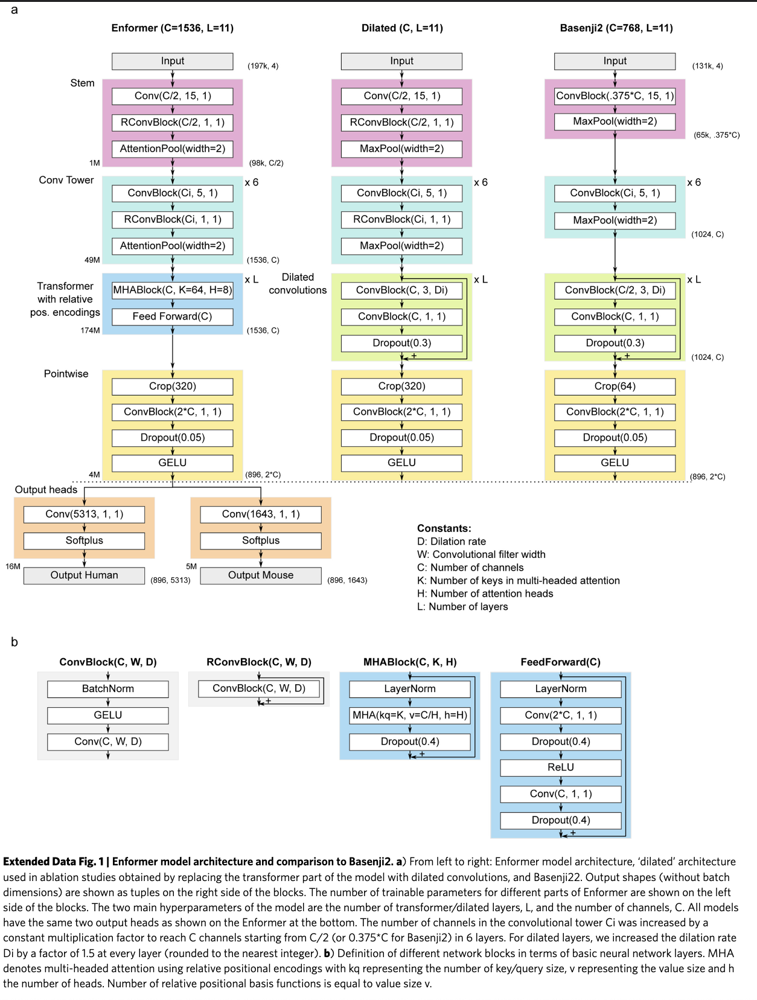

## Enformer: the model

::: {.source-credit-linked}
[Avsec et al., Nature Methods 2021](https://doi.org/10.1038/s41592-021-01252-x)
:::

**Input:** 196,608 bp of DNA sequence (one-hot encoded)

**Output:** Predicted signal at 896 genomic bins for:

- 5,313 human epigenomic tracks (CAGE, DNase-seq, ChIP-seq)
- 1,643 mouse epigenomic tracks

**Architecture:** CNN stem → convolutional tower → transformer → prediction heads

**Key innovation:** Transformer attention captures enhancer–promoter interactions across the full 200 kb window.


## Overview: five stages

```
Input (B, 196608, 4)
       ↓
  [1] Stem                Conv1d + residual + softmax pool   → (B, 768, 98304)
       ↓
  [2] Conv Tower          6 stages, expanding channels       → (B, 1536, 1536)
       ↓
  [3] Transformer         11 layers, relative attention      → (B, 1536, 1536)
       ↓
  [4] Crop + Pointwise    center crop + expand dim           → (B, 896, 3072)
       ↓
  [5] Prediction Heads    per-species linear + Softplus      → (B, 896, 5313)
```

Total sequence compression: **128×** (196,608 → 1,536 positions before crop)

---

## Architecture diagram

::: {.source-credit-linked}
[Avsec et al., Nature Methods 2021 — Extended Data Fig. 1](https://doi.org/10.1038/s41592-021-01252-x)
:::

{width="80%" fig-align="center"}

---

## Block definitions

Three building blocks appear throughout:

::: {.columns}

:::: {.column width="50%"}
**ConvBlock(C, k)**
```
BatchNorm1d
    ↓
  GELU
    ↓
Conv1d(C, kernel=k, padding=same)
```

**RConvBlock(C, k)**
```
x + ConvBlock(C, k)    ← residual
```
::::

:::: {.column width="50%"}
**SoftmaxPool(n)**

For each window of n adjacent positions, learn a **per-channel attention weight** and take the weighted sum.

Better than max pooling (keeps information from both positions) and average pooling (can focus).

Halves sequence length.
::::

:::

---

## Stage 1: Stem

::: {.columns}

:::: {.column width="55%" style="font-size: 1.15em;"}
```
Input (B, 196608, 4)
    ↓  Rearrange → (B, 4, 196608)
    ↓  Conv1d(4→768, kernel=15)
    ↓  RConvBlock(768, kernel=1)
    ↓  SoftmaxPool(2)
Output (B, 768, 98304)
```
::::

:::: {.column width="45%" style="font-size: 0.72em;"}
**Design choices:**

- **kernel=15:** wide enough to detect TF binding motifs (6–20 bp)
- **RConvBlock(k=1):** pointwise channel mixing without expanding receptive field
- **SoftmaxPool:** first 2× downsampling
- Works at **half** the final channel width (768, not 1536)
::::

:::

---

## Stage 2: Convolutional Tower

::: {.columns}

:::: {.column width="55%" style="font-size: 0.82em;"}
Six identical-structure stages:

```
ConvBlock(Cᵢ→Cᵢ₊₁, kernel=5)   ← no residual
    ↓
RConvBlock(Cᵢ₊₁, kernel=1)      ← with residual
    ↓
SoftmaxPool(2)                   ← halve length
```

Channel progression (geometric, rounded to 128):

**768 → 896 → 1024 → 1152 → 1280 → 1536**
::::

:::: {.column width="45%" style="font-size: 0.72em;"}
After stem + 6 stages:

| Stage | Channels | Sequence |
|-------|----------|----------|
| Stem out | 768 | 98,304 |
| Stage 1 | 768 | 49,152 |
| Stage 2 | 896 | 24,576 |
| Stage 3 | 1024 | 12,288 |
| Stage 4 | 1152 | 6,144 |
| Stage 5 | 1280 | 3,072 |
| Stage 6 | **1536** | **1,536** |
::::

:::

---

## Conv Tower: what it learns

::: {.columns}

:::: {.column width="50%" style="font-size: 0.75em;"}
**Local → abstract hierarchy:**

- Early layers: individual nucleotides, simple motifs
- Mid layers: composite motifs, chromatin states
- Late layers: regulatory module signatures

Each pooling step **doubles** the genomic span each unit sees.

By stage 6, each of the 1,536 positions represents **128 bp** of original sequence.
::::

:::: {.column width="50%" style="font-size: 0.75em;"}
**Why geometric channel growth?**

`channels ∝ base^stage`

Constant ratio between stages — a principled inductive bias that larger feature spaces are needed as representations become more abstract.

**Why no residual on the k=5 conv?**

Channel dimensions change between stages (in ≠ out), so a skip connection isn't possible there.
::::

:::

---

## Stage 3: Transformer

::: {.columns}

:::: {.column width="55%" style="font-size: 0.82em;"}
**11 layers.** Input rearranged to (B, 1536 positions, 1536 dim).

Each layer:
```
LayerNorm
  → MultiHeadAttention (8 heads)
  → Dropout(0.4)
[+ residual]

LayerNorm
  → Linear(1536→3072) → Dropout(0.4) → ReLU
  → Linear(3072→1536) → Dropout(0.4)
[+ residual]
```
::::

:::: {.column width="45%" style="font-size: 0.82em;"}
**Attention dimensions:**

| | |
|--|--|
| Heads | 8 |
| Key dim | 64 per head |
| Value dim | 192 per head |

Key/query dim (64) < value dim (192): keys determine *where* to attend; values carry *what* to mix.

Output projection is **zero-initialized** → each layer starts as identity.
::::

:::

---

## Relative positional encoding

**Why not absolute position?**

An enhancer 50 kb upstream has the same effect regardless of where in the genome it sits. What matters is **relative distance** between positions.

The attention logit for position $i$ attending to $j$:

$$\text{logit}(i,j) = \underbrace{(q_i + b_c) \cdot k_j}_{\text{content}} + \underbrace{(q_i + b_p) \cdot r_{j-i}}_{\text{position}}$$

$r_{j-i}$ is a learned encoding of the distance $j-i$.

---

## Relative positional encoding: distance basis functions

**Three basis functions** encode $r_{j-i}$:

::: {.columns}

:::: {.column width="33%"}
**Exponential decay**

Nearby positions matter more. 64 scales from fine to coarse.
::::

:::: {.column width="33%"}
**Central mask**

Step functions: "within k positions?" Binary windows of increasing width.
::::

:::: {.column width="33%"}
**Gamma PDF**

Peaked functions. Can encode "matters most at distance X."
::::

:::

Together: rich vocabulary of distance relationships, learned from data.

---

::: {.takehome}
**At 1,536 positions × 128 bp/position:** attention between positions 0 and 1,535 spans the full 196,608 bp window — capturing enhancer–promoter interactions impossible for the CNN alone.
:::

---

## Stage 4: Crop + Pointwise

::: {.columns}

:::: {.column width="50%"}
**Center crop: 1,536 → 896 positions**

```
Remove 320 positions from each end
```

Edge positions have asymmetric context — they can't "see" past the sequence boundary. The central 896 positions have full, symmetric context on both sides.

In genomic coordinates: 896 × 128 bp = **114,688 bp** of predictions from a 196,608 bp input.
::::

:::: {.column width="50%"}
**Pointwise projection: 1,536 → 3,072**

```
Linear(1536→3072)
  → Dropout(0.05)
  → GELU
```

Expands the shared representation before species-specific heads. Lower dropout (0.05 vs 0.4) — we're close to the output.
::::

:::

---

## Stage 5: Prediction Heads

::: {.columns}

:::: {.column width="50%"}
```
Human head:
  Linear(3072→5,313) → Softplus

Mouse head:
  Linear(3072→1,643) → Softplus
```

Applied independently at **each of the 896 positions**.

The trunk is **fully shared** between species. Only the final linear layers differ.
::::

:::: {.column width="50%" style="font-size: 0.78em;"}
**Why Softplus?**

Epigenomic signals are non-negative counts.

- ReLU: non-negative ✓, but zero gradient for negative inputs ✗
- Softplus = log(1 + eˣ): non-negative ✓, smooth ✓, gradient everywhere ✓

**Why train on two species?**

Joint training forces the trunk to learn **conserved regulatory grammar**. Features that matter in both human and mouse are more likely to be biologically real.
::::

:::

---

## Full shape summary

| Stage | Output shape |
|-------|-------------|
| Input | (B, 196608, 4) |
| Stem | (B, 768, 98304) |
| Conv Tower | (B, 1536, 1536) |
| Transformer | (B, 1536, 1536) |
| Center crop | (B, 896, 1536) |
| Pointwise | (B, 896, 3072) |
| Human head | **(B, 896, 5313)** |

# Part 3: Loss Function {background-color="#1e3a5f" style="color:white;"}

---

## Why Poisson NLL?

::: {.columns}

:::: {.column width="50%" style="font-size: 0.82em;"}
**What are we predicting?**

Epigenomic tracks are **read counts** from sequencing:

- ChIP-seq: reads mapping to each 128 bp bin
- CAGE: reads at each TSS bin
- DNase-seq: reads in accessible regions

Count data is naturally modeled as **Poisson distributed**.
::::

:::: {.column width="50%" style="font-size: 0.82em;"}
**Poisson distribution:**

$$P(y \mid \lambda) = \frac{e^{-\lambda} \lambda^y}{y!}$$

- $\lambda$: predicted rate (Softplus output)
- $y$: observed count

**Poisson NLL loss:**

$$\mathcal{L} = \lambda - y \log \lambda + \text{const}$$

Penalizes overestimating sparse tracks heavily. Scales naturally with signal magnitude.
::::

:::

---

::: {.takehome}
**Rule of thumb:** when targets are non-negative counts with variance ≈ mean, use Poisson NLL. MSE would underweight high-count bins and treat all errors equally regardless of scale.
:::

# Part 4: Data & Augmentation {background-color="#1e3a5f" style="color:white;"}

---

## Training data

::: {.columns}

:::: {.column width="50%" style="font-size: 0.78em;"}
**Human: 5,313 tracks**

- CAGE (transcription start site activity)
- DNase-seq (open chromatin / accessibility)
- ChIP-seq — histone marks: H3K27ac, H3K4me1, H3K4me3, H3K36me3, ...
- ChIP-seq — TF binding: CTCF, POLR2A, ...

Sources: ENCODE, Roadmap Epigenomics, GEO
::::

:::: {.column width="50%" style="font-size: 0.78em;"}
**Mouse: 1,643 tracks**

Same assay types, profiled in mouse tissues.

**Data format:**

- HDF5 files
- One-hot encoded sequences: shape (L, 4)
- Target values: shape (896, N_tracks)
- Pre-split into train / validation / test chromosomes
::::

:::

---

## Augmentation 1: Sequence shift

::: {.columns}

:::: {.column width="52%" style="font-size: 0.82em;"}
**What:** randomly shift the input sequence by ±1–4 bp, re-center the prediction window.

```
Original:  [----196,608 bp----]
                 ↓ predict
           [------896 bins-----]

Shifted+3: [---196,608 bp---]
                 ↓ predict
             [----896 bins----]
```
::::

:::: {.column width="44%" style="font-size: 0.72em;"}
**Why:**

- The model shouldn't care whether a motif falls at position 1,000 or 1,003
- Shift augmentation teaches **translation invariance** at the nucleotide level
- Especially important because the conv tower compresses by 128×: a 1 bp shift is sub-resolution without augmentation
::::

:::

---

## Augmentation 2: Reverse complement

::: {.columns}

:::: {.column width="50%"}
**What:** flip the sequence strand.

```
Forward:  5'–ACGT...ACGT–3'
Reverse complement:
          3'–TGCA...TGCA–5'
             ↕ reverse ↕
          5'–ACGT...TGCA–3'
```

Applied by:
1. Reversing the sequence order
2. Swapping A↔T and C↔G (complement)
::::

:::: {.column width="50%"}
**Why:**

- DNA is double-stranded — the same gene exists on both strands
- TF binding motifs are often palindromic, but not always
- The model must learn to recognize regulatory elements **regardless of strand orientation**
- Also doubles the effective training set size
::::

:::

::: {.takehome}
Both augmentations exploit known biological symmetries. The model doesn't need to learn "this motif on the + strand is different from the same motif on the − strand" — that's baked in.
:::

---

## Summary

::: {.columns}

:::: {.column width="50%"}
**Architecture:**

- **Stem:** motif detection, 2× compression
- **Conv Tower:** hierarchical features, 64× compression (6 stages)
- **Transformer:** long-range regulatory interactions (up to 196 kb)
- **Heads:** per-species predictions, Softplus output
::::

:::: {.column width="50%"}
**Training:**

- **Loss:** Poisson NLL — right for count data
- **Augmentation:** shift (±4 bp) + reverse complement
- **Multi-species:** joint human + mouse training for regularization
- **Targets:** 5,313 human + 1,643 mouse epigenomic tracks
::::

:::

::: {.source-credit-linked}
[Avsec et al., Nature Methods 2021](https://doi.org/10.1038/s41592-021-01252-x)
:::
